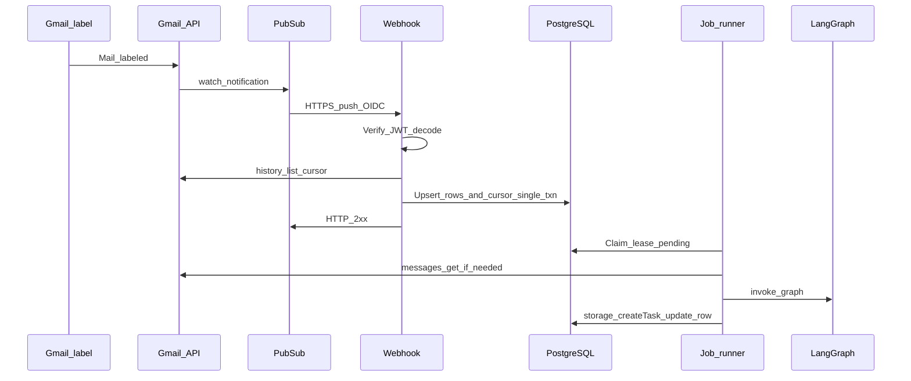

# Email-triggered LangGraph → Kanban task (Gmail + Pub/Sub)

## Current integration points

- **Create tasks**: [`server/routes.ts`](server/routes.ts) exposes `POST /api/tasks` with `insertTaskSchema` from [`shared/schema.ts`](shared/schema.ts).
- **Persistence**: [`server/storage.ts`](server/storage.ts) `DatabaseStorage.createTask()` — only the **internal job runner** calls it after LangGraph; reuse the same Zod shape.
- **Default stage**: [`server/seed.ts`](server/seed.ts) seeds [`SEED_STAGE_NAMES.BACKLOG`](shared/constants.ts). Stage resolution rules are defined in §Stage resolution.

## Architecture (unchanged core shape)

1. **Gmail**: Dedicated label **`kanbando-trigger`**; filter routes trigger mail into that label; **`users.watch`** with **`labelIds`** = that label only.
2. **GCP**: Pub/Sub topic → **push subscription** with **OIDC** to the webhook URL.
3. **Webhook**: Verify JWT, scan history, **persist inbound rows + cursor** in one transaction ordering (see §Cursor advancement), return **2xx** fast; **no LLM**.
4. **Job runner**: Poll every **15 seconds**; **`pending`** rows → claim with lease (**10 minutes**) → **`users.messages.get`** (unless body already stored) → normalize → LangGraph → **`storage.createTask`** → terminal row state.
5. **Tables**: **`inbound_email_processing`** (see §Schema) and **`gmail_watch_cursor`** (see §Cursor store).
6. **Auth v1**: **Single mailbox**; **OAuth client id + secret + refresh token** in env; **no** service account, **no** domain-wide delegation.

## Identifiers: cursor vs dedupe

| Concept | Role |
|--------|------|
| **`historyId` (Gmail)** | **History cursor only** — input to `users.history.list`. **Never** a dedupe key. |
| **Primary idempotency key** | **`(provider, gmail_message_id)`** — unique constraint; all inbound upserts and task-creation idempotency tie to this row. |
| **`rfc_message_id`** | **Secondary diagnostic field** — stored for support, debugging, future cross-provider work; **not** used for uniqueness in v1. |
| **Task creation idempotency** | Enforced by the **inbound processing row** keyed by **`provider + gmail_message_id`**: a completed row with `created_task_id` set must never spawn a second task. |

## Cursor advancement

Advance **`gmail_watch_cursor.history_id`** **only after** all candidate inbound rows discovered from that history window have been successfully upserted **in a single committed database transaction** with the new cursor value. **Never** advance the cursor before durable row persistence completes.

- If the history scan returns **no** candidate messages but **`users.history.list` succeeds**, the cursor **still advances** in that same committed transaction (empty window is valid).
- If **database persistence fails** (transaction rolls back), **do not** advance the cursor.
- **Webhook retries** (Pub/Sub redelivery) are safe because **row upserts are idempotent** on **`(provider, gmail_message_id)`**.

## v1 fixed constants

| Constant | Value |
|----------|--------|
| **Recovery window** (bounded resync lookback) | **72 hours** |
| **Lease timeout** | **10 minutes** (`lease_expires_at = claim_time + 10 minutes`) |
| **`max_attempts`** | **5** |
| **Runner poll interval** | **15 seconds** |

## Cursor store

Single design: table **`gmail_watch_cursor`** with columns **`mailbox`**, **`history_id`**, **`updated_at`**. The webhook reads and updates **`history_id`** only in the same committed transaction as inbound row upserts (§Cursor advancement). No alternate cursor representations in v1.

## History cursor recovery

If `users.history.list` **cannot** resume from the stored cursor because the cursor is **stale**, **invalid**, or **outside Gmail’s retained history window**, v1 behavior is:

1. Perform a **bounded resync** over the **watched label** for a **72-hour recovery window** (**not** an open-ended full mailbox scan).
2. **Upsert** discovered messages by primary dedupe key **`(provider, gmail_message_id)`**.
3. **Log an operational warning** (see §Observability).
4. Update **`gmail_watch_cursor.history_id`** from the successful resync response in the same committed transaction as upserts.

**Rules:**

- Recovery window is **72 hours**; normal path remains incremental `history.list` from the stored cursor in **`gmail_watch_cursor`**.
- **Duplicates** during resync overlap with prior upserts are acceptable: upserts are **idempotent**.
- This path is **recovery**; it is not the steady-state handler.

## Inbound table: `inbound_email_processing`

**Unique constraint:** `(provider, gmail_message_id)`.

| Column | Specification |
|--------|----------------|
| `id` | Surrogate PK (inbound row id for logs). |
| `provider` | e.g. `gmail`. |
| `gmail_message_id` | Gmail API message `id`; part of primary key. |
| `rfc_message_id` | Parsed `Message-ID` header; diagnostic; nullable if missing. |
| `history_id_seen` | Gmail history id associated when this row was written; audit, not dedupe. |
| `recipient` | Normalized trigger address. |
| `normalized_subject` | For display and debugging. |
| `normalized_body_hash` | Optional integrity/auxiliary field; **not** a primary dedupe mechanism. |
| `processing_status` | Enum: **`pending` \| `processing` \| `completed` \| `failed`**. |
| `created_task_id` | Nullable until success; FK to `tasks.id` when `completed`. |
| `error_reason` | Latest meaningful failure summary when `failed` or last error while retrying. |
| `processed_at` | Set when terminal state (`completed` or `failed`) is reached. |
| `attempt_count` | Integer; incremented **only** when a worker **successfully claims** the row (see §Worker leasing). |
| `last_attempt_at` | Timestamp of last claim attempt. |
| `lease_expires_at` | Nullable; set when status is `processing`; reclaim when expired. |
| `created_at` | Row creation time. |
| `updated_at` | Row last update time. |

## Worker leasing and retries

- Workers select rows with **`processing_status = pending`** using **`FOR UPDATE SKIP LOCKED`** so concurrent workers do not claim the same row.
- **Successful claim** (transaction commits the transition from **`pending`** to **`processing`**):
  - **`processing_status = processing`**
  - **`last_attempt_at = now()`**
  - **`lease_expires_at = now() + 10 minutes`**
  - **`attempt_count = attempt_count + 1`**
- **Reclaim** (stale lease): eligible **only** when **`processing_status = 'processing'`** AND **`lease_expires_at < now()`** AND **`attempt_count < 5`**. Transition back to **`pending`** (clear **`lease_expires_at`**). **Reclaim does not increment `attempt_count`.** **Reclaim does not clear `error_reason`** except when a later failure overwrites it. If **`attempt_count = 5`** and lease is expired while still **`processing`**, set **`failed`** (cap reached; do not reclaim to **`pending`**).
- **`max_attempts` = 5**: when a processing run **ends in error** after a successful claim, set **`error_reason`**. If **`attempt_count < 5`**, set **`processing_status = pending`** (next claim increments toward the cap). If **`attempt_count = 5`**, set **`processing_status = failed`** (no further claims).
- **`completed`** rows are **terminal**; the runner **must not** reprocess them.
- **Task creation** must be **idempotent relative to the inbound row**: before creating a task, check row state; only one `created_task_id` for a given completed flow.

## Push handler response contract

- The webhook **does not invoke the LLM**.
- **Webhook responsibilities only:**
  1. Verify Pub/Sub **OIDC JWT**.
  2. Decode Pub/Sub envelope.
  3. Read **`gmail_watch_cursor.history_id`** for the monitored **`mailbox`**.
  4. Query Gmail **`users.history.list`** (and recovery path when required).
  5. **Upsert** inbound rows with **`gmail_message_id`** and **minimal metadata** (no full message body; no **`users.messages.get`** in the webhook).
  6. **Commit** **`gmail_watch_cursor.history_id`** + inbound rows in **one transaction** per §Cursor advancement.
  7. Return **2xx**.
- Return **5xx** only for **transient failures before** durable persistence completes (Gmail 5xx, DB unavailable, transaction not committed).
- **After** rows and cursor are **durably persisted**, **always return 2xx**, even if downstream processing (worker) may later fail.
- **Duplicate Pub/Sub deliveries** are harmless: webhook writes are **idempotent** on **`(provider, gmail_message_id)`**.

## Normalization boundary (v1)

- Prefer **`text/plain`** body.
- If **multipart**, extract the **first usable** `text/plain` part.
- **Fallback** to Gmail **`snippet`** only when no plain text body is available.
- **Ignore attachments** entirely in v1.
- Apply **minimal conservative** quoted-reply stripping only.
- **Do not** implement full MIME or email-client-grade interpretation in v1.

## Stage resolution

- LangGraph may emit **`targetStageName`** as a **suggestion only**.
- **Application code** resolves **`stageId`** deterministically from **`storage.getStages()`** actual names.
- **Normalized exact match** only: trim Unicode whitespace, apply **Unicode NFKC**, compare stage names **case-insensitively** (e.g. `localeCompare` with sensitivity or lowercased NFKC strings).
- If **no** match: **`stageId` = Backlog stage** (by seeded name **`Backlog`** or `SEED_STAGE_NAMES.BACKLOG`).
- The model **must not** invent new stage names that create stages; unknown names map to Backlog.

## Auth (v1)

- **One** monitored mailbox.
- **OAuth 2.0** user credentials: **`GOOGLE_CLIENT_ID`**, **`GOOGLE_CLIENT_SECRET`**, **`GOOGLE_REFRESH_TOKEN`** in environment.
- **No** service account impersonation and **no** Workspace domain-wide delegation in v1.
- **Re-authentication** when refresh is revoked or scopes change: document as an **operational runbook note** only (not a code path in this plan).

## Google Cloud + Gmail (external setup)

- Pub/Sub topic, push subscription, OIDC audience = webhook URL, Gmail publisher IAM on topic.
- Gmail API enabled; label **`kanbando-trigger`** exists; **`users.watch`** with that label id; renew watch before expiry.
- OAuth scopes: sufficient for `watch`, `history.list`, `messages.get`, label management per Google’s current docs.

## Job runner + LangGraph

- **Runner**: In-process loop; **poll every 15 seconds**; same codebase as `server/index.ts` startup.
- **Gmail fetch rule**: The **webhook** persists **ids and minimal metadata only** (see §Push handler). The **runner** calls **`users.messages.get`** **before** normalization **unless** a **normalized body is already durably stored** on the row (v1 does not pre-store bodies on insert; **`messages.get` runs before every normalize** until such a column exists and is populated).
- **Pipeline**: **`users.messages.get`** (when required) **→** normalize (§Normalization) **→** LangGraph structured output **→** stage resolution **→** `storage.createTask` **→** update inbound row to **`completed`** with **`created_task_id`**.
- **LangGraph**: `@langchain/langgraph` + `@langchain/core` + one chat provider; **LLM keys** in env separate from Google.

## Observability

**Required log fields per inbound processing flow:**

- Inbound **row id**
- **`gmail_message_id`**
- **`gmail_watch_cursor.history_id`** before scan
- **`gmail_watch_cursor.history_id`** after successful commit (same request)
- **`attempt_count`**
- **Final outcome** (`completed` / `failed`)
- **`created_task_id`** on success

**Also:**

- **Warnings** on **history recovery** path (bounded resync).
- **Duplicate upsert** (idempotent replay) → **debug** or **info** level; **not** an error.

## Tests (complete matrix)

**Webhook**

- Valid Pub/Sub push **inserts/upserts** rows and returns **2xx**.
- Webhook **does not** call **`users.messages.get`** (metadata-only upserts).
- Webhook **does not** call LLM (assert mock or absence).
- **Duplicate** Pub/Sub delivery **does not** create duplicate inbound rows (same `provider + gmail_message_id`).
- Transient Gmail or DB failure **before** commit **returns 5xx**.
- Failure **after** successful row persistence **still returns 2xx** (simulate: DB fails on second phase only if split — if single txn, test “persisted then ack” by not failing post-commit).

**Cursor**

- Cursor **advances only after** successful commit.
- Cursor **does not advance** when persistence fails.
- **Stale** cursor triggers **72-hour bounded resync** path (mock Gmail API responses).

**Worker**

- Same **`gmail_message_id`** processed twice → **one** task only.
- **`attempt_count` increments only on successful claim**, not on reclaim.
- **Expired lease** with **`attempt_count < 5`**: **reclaim** returns row to **`pending`** without incrementing **`attempt_count`**; **`error_reason`** not cleared by reclaim alone. **`attempt_count = 5`** + expired lease → **`failed`**, not reclaim.
- After **5** failed processing cycles (**`attempt_count = 5`** and run fails), row is **`failed`**.
- **`completed`** rows are **never** reprocessed.

**Normalization**

- Runner invokes **`users.messages.get`** before normalize when body not durably stored (v1: always for new rows).
- Plain text **preferred** over snippet.
- **Multipart** plain extraction works.
- **Attachments** ignored.

**Stage resolution**

- Exact normalized match resolves correct stage.
- Unknown stage **falls back to Backlog**.

## Files likely touched

| Area | Files |
|------|--------|
| Schema | [`shared/schema.ts`](shared/schema.ts), Drizzle migration(s), **`gmail_watch_cursor`** + **`inbound_email_processing`** |
| Webhook | [`server/routes.ts`](server/routes.ts), `server/webhooks/gmail-pubsub.ts` |
| Gmail | `server/gmail/client.ts` |
| Runner | `server/jobs/process-inbound-email.ts`, [`server/index.ts`](server/index.ts) |
| Graph | `server/langgraph/email-task-graph.ts` |
| Ops | Short re-auth note in `development/` or README |

## Non-goals for v1

- Attachment ingestion or parsing.
- Workspace domain-wide delegation.
- Separate worker service or process (in-process runner only).
- Multi-provider email ingestion.
- User-configurable stage mapping rules (fixed deterministic rules only).

---

## Plan is implementation-ready when all of the following are true

- [ ] **Cursor advancement order** is implemented: single commit bundles upserts + **`gmail_watch_cursor.history_id`**; no advance on rollback.
- [ ] **Stale-history recovery** is implemented: **72-hour** bounded window, idempotent upserts, warning logs, fresh **`gmail_watch_cursor.history_id`** after commit.
- [ ] **Dedupe key** is enforced: unique **`(provider, gmail_message_id)`**; **`rfc_message_id`** diagnostic only.
- [ ] **Worker lease, reclaim, and `max_attempts`** match §Worker leasing.
- [ ] **Webhook response contract** matches §Push handler: no LLM; 2xx after durable persist; 5xx only before commit.
- [ ] **Normalization boundary** matches §Normalization (plain → multipart plain → snippet; no attachments; minimal quote strip).
- [ ] **Tests** cover: duplicate Pub/Sub, pre- vs post-persist 5xx/2xx, cursor rules, recovery path, worker idempotency, lease reclaim, `max_attempts`, normalization, stage fallback.

---

## What changed and why

| Change | Why |
|--------|-----|
| **Exact cursor commit rule** | Removes ambiguity that caused double-processing or skipped mail when cursor moved without durable rows. |
| **History recovery subsection** | Gmail history is finite; stale cursors are inevitable — bounded resync is specified so implementers do not guess. |
| **Primary key `provider + gmail_message_id`** | Single dedupe story; `rfc_message_id` kept as diagnostic only per your requirement. |
| **Schema: lease, attempts, timestamps** | Makes worker concurrency and stuck-job behavior implementable without ad hoc flags. |
| **Worker leasing rules** | Aligns `SKIP LOCKED`, leases, and `max_attempts` with observable row fields. |
| **Push response contract** | Separates Pub/Sub ack from LLM failures; prevents duplicate tasks from retry storms after successful persist. |
| **Normalization boundary** | Stops scope creep into full MIME parsing while keeping testable rules. |
| **Deterministic stage resolution** | Prevents model-invented stage names from breaking DB integrity. |
| **Auth narrowed to OAuth refresh only** | Removes half-open “SA or delegation” options for v1. |
| **Observability list + recovery warnings** | Operations can trace cursor, idempotency, and recovery without treating idempotent replays as incidents. |
| **Expanded tests** | Acceptance criteria are now test-mapped; reduces “done” without coverage of failure modes. |
| **Non-goals + checklist** | Gates “implementation-ready” on explicit semantics, not intent. |
| **v1 constants + `gmail_watch_cursor`** | Fixed 72h / 10m / 5 / 15s; single cursor table; removes placeholder “N hours” and alternate cursor designs. |
| **Reclaim + `attempt_count` rules** | Reclaim predicate exact; no double-count on reclaim; `error_reason` preserved unless overwritten by new failure. |
| **Webhook vs runner `messages.get`** | Thin webhook stores metadata only; runner fetches before normalize unless body durably stored. |

