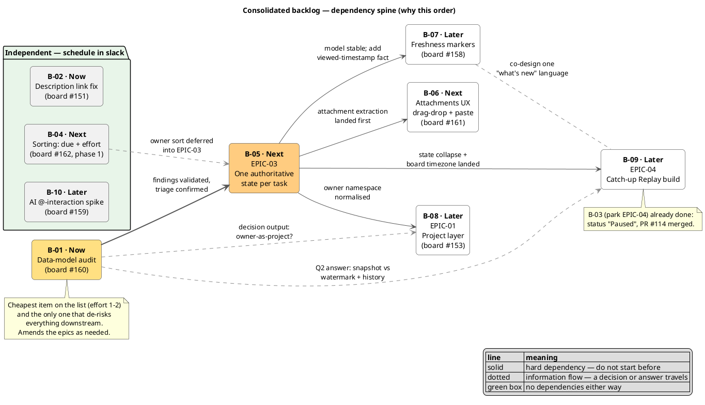

# Consolidated dev backlog

**Status:** Live — supersedes the loose board chatter as the ordered dev list
**Last consolidated:** 14 Aug 2026, from board tasks #151–#162 + EPIC-01/03/04
**Convention:** items carry a stable `B-xx` id for tracking; board task ids and epic
docs are cross-referenced so nothing exists in two places with two meanings.

## How the chatter consolidated

| Board task | What it said | Where it landed |
|---|---|---|
| #160 Data model audit | full audit, pain points, triage, maybe rebuild | **B-01** (and it front-runs EPIC-03) |
| #151 Bug: description links (email arrived twice — one task) | `file://` not hyperlinking; display names for links | **B-02** |
| #153 Project layer | project scoping; 13 Aug thought: "owner becomes project?" | Already captured as **EPIC-01** (task says "epic 3" — that's a mis-reference; project layer is EPIC-01). The owner-as-project thought becomes an explicit **B-01 audit question** |
| #158 Visual interaction feedback | clicked-in-24h shade change, freshness markers | **B-07** |
| #159 AI UX research | @-mention / MCP-style interactions in boards | **B-09** |
| #161 Drag-drop / screenshot paste in description | attachments UX | **B-06** — hard-gated by EPIC-03's attachment extraction |
| #162 Sorting options | due date / effort / owner sorts | Split: **B-04** (due+effort, safe now) and the owner sort folded into **B-05** (needs EPIC-03's single owner namespace) |

## Ordered backlog

### Now

**B-01 — Data-model audit** · board #160 · effort 1–2 · due 31 Aug
Raise board priority Low → **High** (agreed 14 Aug: it gates everything below).
Scope: re-validate EPIC-03's seven findings against *current* production data; find
anything new. Three explicit questions whose answers are audit outputs:
1. Is task history complete/trustworthy enough to reconstruct past states?
   (→ answers EPIC-04 open Q2, snapshot vs watermark)
2. What would EPIC-04's witnessed-checkpoint table need that the model lacks?
3. Owner-as-project (board #153, 13 Aug update): should EPIC-01's project layer be
   an entity, or collapse into a normalized owner namespace? One recommendation,
   argued against EPIC-03's assignment findings and the EPIC-02 identity boundary.
Output: audit report in `docs/`, EPIC-03 confirmed/amended, triage of any new finds.

**B-02 — Description link handling** · board #151 · effort 2 · due 26 Aug
Bug + small enhancement, independent of everything: `file://` URIs don't render as
links; add display-name support for both web and local links.
Reality check to capture in the task: browsers block `file://` navigation from
http(s) pages — "make it a hyperlink" needs a deliberate mechanism (copy-path
affordance, custom protocol, or local-open endpoint), not just an anchor tag.
Quick win; can ship while B-01 runs.

**B-03 — Park EPIC-04 cleanly** · admin
Merge PR #114 (v2 of the epic), add a "Paused — pending B-01/EPIC-03" status line.
No further EPIC-04 work until B-01 reports.

### Next

**B-04 — Board sorting, phase 1: due date + effort** · from board #162 · effort 1
Due-date and effort sorts read unambiguous fields and can ship on the current model.
Owner sort is **excluded** here — `owner` vs swimlane-tag is exactly the ambiguity
EPIC-03 removes; sorting on it now would sort wrong.

**B-05 — EPIC-03: One authoritative state per task** · 2–3 sprints (~34 pts)
The big rock. Refine with B-01's report in hand, then implement.
Sequencing inside the epic: pull the **attachment extraction** story early (it
unblocks B-06 and removes the 97% payload problem), and the **state collapse +
board timezone** stories early (they unblock EPIC-04). Owner sort from #162 lands
as a trailer story once assignment is one namespace.

**B-06 — Attachment UX: drag-drop + screenshot paste** · board #161 · effort 1–2
Gated by B-05's attachment extraction. Building this first would pump more base64
into `description` — the single worst finding in EPIC-03 (533 KB of a 547 KB
payload). Once attachments are real entities: drag-drop onto the modal, clipboard
paste for screenshots, dynamic preview.

### Later

**B-07 — Ambient freshness markers** · board #158 · effort 1–2
Clicked-within-24h shade change + at-a-glance interaction cues. Two reasons it
waits: it needs a *viewed/interacted* timestamp (a new fact — `updatedAt` only
tracks mutations), which shouldn't be added mid-model-flux; and it's a sibling of
EPIC-04's awareness thesis — design them together so the board has one coherent
"what's new/what's touched" language, not two competing ones.

**B-08 — EPIC-01: Project scoping** · 2 sprints (~21 pts)
After B-05, and shaped by B-01's owner-as-project recommendation — that answer
either confirms EPIC-01 as written or collapses it into the owner namespace.
Do not start EPIC-01 implementation before that decision is recorded.

**B-09 — EPIC-04: Catch-up Replay — implementation planning, then build**
Resumes when B-01 answers Q2 and B-05's state/timezone stories have landed.
Plan against the 10-step skeleton in the epic doc (adapter → checkpoint →
headless state machine → reduced-motion presentation first).

**B-10 — Research spike: AI @-interaction patterns** · board #159 · effort 2 · Low
Timeboxed spike (suggest 1 day): how Jira/Confluence-class boards do @/slash/agent
interactions, how fragile, what to replicate; output is user stories only.
No dependencies — parallelizable whenever there's slack; deliberately last so it
can't displace committed work.

**Library question already answered (14 Aug, from board chatter suggesting `cmdk`
or Plate JS): use neither — use `@tiptap/suggestion`.** The description field is
already Tiptap 3 (`client/src/components/RichTextEditor.tsx`, StarterKit +
Placeholder), which the chatter didn't account for.

- **Plate JS is a Slate-based editor framework** — adopting it means replacing
  Tiptap wholesale, migrating serialization and every consumer of description HTML
  (`RichTextContent.tsx`, export, briefing). An enormous change to acquire a menu.
- **`cmdk` is the wrong shape** (and not currently installed — no shadcn
  `command.tsx`). It is built for *overlay* palettes with their own focus and input.
  An in-editor slash menu is the inverse: the caret stays in the document, the query
  is the text typed after the trigger, and the popup only borrows arrow keys/Enter.
- **`@tiptap/suggestion` is the exact primitive**: configurable trigger character,
  match/range tracking, render callbacks for a popup you supply, and correct
  replacement of the trigger range on select. First-party, same mechanism behind
  Notion-style slash menus; `@tiptap/extension-mention` wraps it for @-people.

**Spike's real deliverable — which insert types are safe before the model is fixed.**
The menu is not the fragile part; what it *inserts* is:

| Insert type | Risk |
|---|---|
| Self-contained content — date, checklist, heading, code block, plain link | Safe. No ids, nothing the data model must guarantee. |
| Entity references — `@person`, `#task`, project | Fragile. Needs a custom node with an id that survives HTML serialization, stays valid across rename/delete, and is understood by every description consumer. |

`@owner` today would encode assignment as a **third** namespace inside description
HTML, on top of the two contradictory ones EPIC-03 documents (`owner` vs swimlane
tags) — inventing a new integrity problem inside the area being repaired. `#task`
has the same defect: no stable permalink until EPIC-03 adds one. Hence entity
references stay behind B-01/B-05.

**Optional early subset:** a slash menu limited to self-contained content could ship
before the model work — it proves the interaction and touches no ambiguous field.
It overlaps B-06's territory (both are description-input UX), so pull it forward
only as one combined piece of work, not a second pass over the same modal.

**Product caution:** slash commands are a power-user idiom whose discoverability
depends on knowing to type a character with no visible affordance. For the audience
described in EPIC-04 — people for whom tool complexity is already the barrier — a
hidden interface reads as "not for me." Any implementation must be an accelerator
layered over visible buttons, never the only route to a capability.

## Dependency spine (why this order)

### Narrative notes — the logic behind the spine

1. **Everything begins with B-01 because it is the cheapest way to find out whether
   everything else is standing on solid ground.** The audit is a one-to-two effort
   task, yet its output determines the shape of a ~34-point epic and, through that,
   three more work items. Doing cheap, high-information work before expensive,
   dependent work is the whole logic of the spine.
2. **B-05 (EPIC-03) is the trunk, not just another branch.** Every ambiguity it
   removes — two contradictory state machines, the double-booked owner field,
   tag-string swimlanes, the untyped due date, base64 blobs inside descriptions — is
   a fault line that some later item would otherwise be built directly on top of.
   Three items wait for it, each for a specific, nameable reason.
3. **B-06 (attachments UX) waits for one specific EPIC-03 story: attachment
   extraction.** Shipped today, every dropped file would become more base64 inside
   the `description` text column — actively growing the single worst measured
   problem in the model (533 KB of a 547 KB payload). The feature isn't hard;
   building it *first* would be building the problem a bigger front door.
4. **B-08 (EPIC-01, projects) waits for a decision, not just for code.** The audit
   carries the question "should a project be its own entity, or should a normalised
   owner become the project?" Until that's answered, EPIC-01 as written might be the
   wrong epic entirely. What travels along the dotted line from B-01 is a decision,
   not software.
5. **B-09 (EPIC-04, the replay) waits for two different things from two different
   places.** From B-01 it needs an *answer*: is task history trustworthy enough to
   reconstruct past states (watermark), or must we snapshot evaluated state
   (checkpoint table)? From B-05 it needs *landed code*: one authoritative task
   state and an explicit board timezone — because a replay that announces "this task
   moved" or "this became overdue" from self-contradicting fields would show wrong
   changes, and this feature's entire hypothesis is building trust.
6. **B-07 (freshness markers) has a soft dependency and a design constraint.** It
   needs a new fact the model doesn't hold — *when a task was last viewed* (today's
   `updatedAt` only tracks edits) — and new facts shouldn't be added while the model
   is mid-rebuild. The dotted line to B-09 isn't a dependency: it says the two
   features must share one visual language for "what's new here," so they are
   designed together even though either could ship first.
7. **The green box is the pressure valve.** B-02, B-04, and B-10 touch nothing on
   the spine and nothing on the spine touches them — pick one up whenever spine work
   is blocked or a small win is wanted. The one nuance is B-04's dotted line: the
   *owner* sort was deliberately cut from phase 1, because sorting on a field the
   model can't yet answer honestly would produce confidently wrong orderings; that
   fragment ships with EPIC-03 once the owner namespace is single.
8. **B-03 doesn't appear as a box because it's already history** — EPIC-04 marked
   Paused, PR #114 merged; the diagram records it as a note so the spine reflects
   only live work.

## Board hygiene actions from this consolidation

- [ ] #160: priority Low → High; link this doc.
- [ ] #153: fix epic reference (project layer is **EPIC-01**, not 3); note that the
      owner-as-project question moved into the B-01 audit scope.
- [ ] #162: split — phase 1 (due/effort) is B-04; owner sort noted on EPIC-03.
- [ ] #161: add "blocked by EPIC-03 attachment extraction" so it isn't picked up early.
- [ ] #158: add "co-design with EPIC-04; needs interaction timestamp" note.
- [ ] #159: record the library conclusion (`@tiptap/suggestion`, not cmdk/Plate) so
      the board chatter doesn't re-litigate it; note entity references are gated by
      EPIC-03.
- [ ] Duplicate #151 email was noise — single task, no action.
