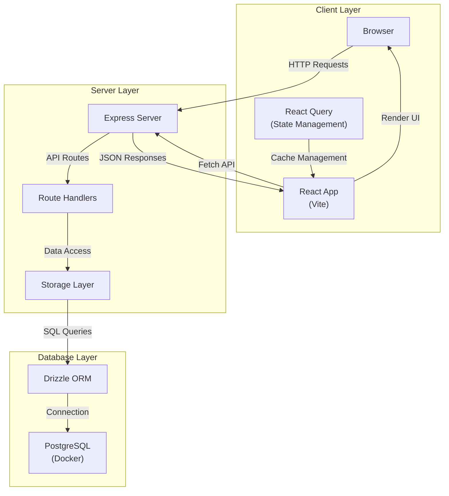
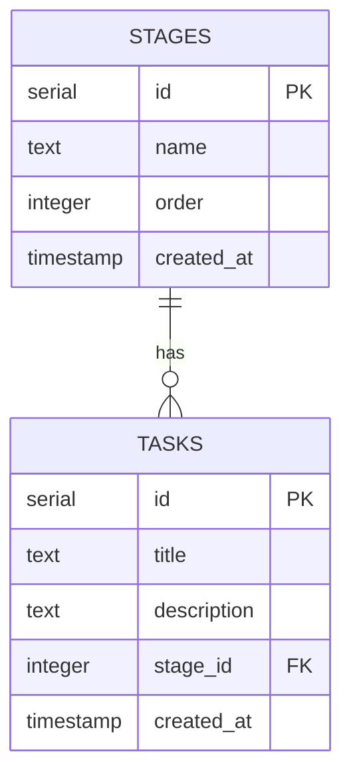
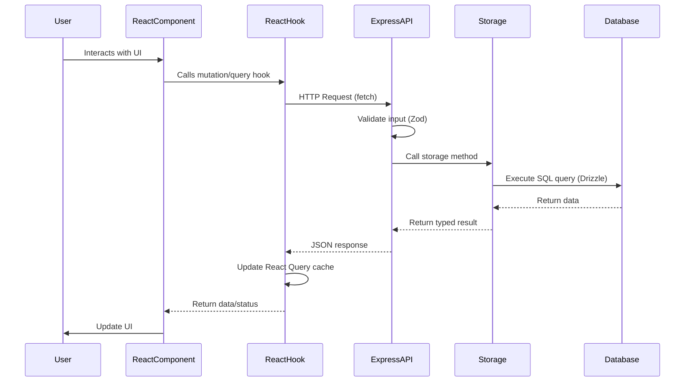

# Architecture Analysis

## System Overview

This is a full-stack Kanban task management application built with Express.js backend, React frontend, and PostgreSQL database. The application provides a drag-and-drop interface for managing tasks across customizable stages.

## System Architecture



## Technology Stack

### Frontend

- **React 18.3.1**: UI framework
- **TypeScript 5.6.3**: Type safety
- **Vite 7.3.0**: Build tool and dev server
- **Wouter 3.3.5**: Lightweight routing
- **TanStack React Query 5.60.5**: Server state management and caching
- **@dnd-kit**: Drag and drop functionality
  - `@dnd-kit/core`: Core drag-and-drop logic
  - `@dnd-kit/sortable`: Sortable list support
- **shadcn/ui**: Component library (Radix UI primitives)
- **Tailwind CSS**: Styling framework
- **React Hook Form**: Form management
- **Zod**: Schema validation

### Backend

- **Express 4.21.2**: Web server framework
- **Node.js**: Runtime environment
- **TypeScript**: Type safety
- **Drizzle ORM 0.39.3**: Type-safe SQL query builder
- **PostgreSQL**: Relational database
- **pg (node-postgres)**: PostgreSQL client

### Development Tools

- **Drizzle Kit**: Database migrations and schema management
- **tsx**: TypeScript execution
- **esbuild**: Production bundling
- **Docker**: Database containerization

## Project Structure

```
kanban-local1/
├── client/                 # Frontend React application
│   ├── src/
│   │   ├── components/     # React components
│   │   │   ├── ui/         # shadcn/ui components
│   │   │   ├── KanbanBoard.tsx
│   │   │   ├── TaskCard.tsx
│   │   │   ├── TaskColumn.tsx
│   │   │   ├── CreateTaskDialog.tsx
│   │   │   └── EditTaskDialog.tsx
│   │   ├── pages/          # Page components
│   │   │   ├── Dashboard.tsx
│   │   │   └── Admin.tsx
│   │   ├── hooks/          # Custom React hooks
│   │   │   ├── use-tasks.ts
│   │   │   └── use-toast.ts
│   │   ├── lib/            # Utilities
│   │   │   ├── queryClient.ts
│   │   │   └── utils.ts
│   │   ├── App.tsx         # Root component
│   │   └── main.tsx        # Entry point
│   └── index.html
│
├── server/                 # Backend Express application
│   ├── index.ts           # Server entry point
│   ├── routes.ts          # API route handlers
│   ├── storage.ts         # Data access layer
│   ├── db.ts              # Database connection
│   ├── static.ts          # Static file serving
│   └── vite.ts            # Vite dev middleware
│
├── shared/                 # Shared code between client/server
│   ├── schema.ts          # Database schema & Zod schemas
│   └── routes.ts          # API route definitions
│
├── migrations/             # Database migrations
├── dist/                  # Production build output
├── documentation/         # Project documentation
├── docker-compose.yml     # PostgreSQL container config
├── vite.config.ts        # Vite configuration
├── drizzle.config.ts     # Drizzle configuration
└── package.json          # Dependencies & scripts
```

## Database Schema



### Schema Definition

The database consists of two main tables:

1. **stages**: Represents columns in the Kanban board
   - `id`: Primary key (auto-increment)
   - `name`: Stage name (e.g., "Backlog", "In Progress", "Done")
   - `order`: Display order for sorting stages
   - `created_at`: Timestamp of creation

2. **tasks**: Represents individual tasks/cards
   - `id`: Primary key (auto-increment)
   - `title`: Task title (required)
   - `description`: Task description (optional)
   - `stage_id`: Foreign key to stages table
   - `created_at`: Timestamp of creation

The relationship is one-to-many: one stage can have many tasks.

## Request/Response Flow



## Key Architectural Patterns

### 1. Shared Type Safety

Types and schemas are defined in `shared/` directory and imported by both client and server:

```12:45:shared/schema.ts
export const insertStageSchema = createInsertSchema(stages).omit({
  id: true,
  createdAt: true,
});

export const insertTaskSchema = createInsertSchema(tasks).omit({
  id: true,
  createdAt: true,
});

export type Stage = typeof stages.$inferSelect;
export type Task = typeof tasks.$inferSelect;
export type InsertStage = z.infer<typeof insertStageSchema>;
export type InsertTask = z.infer<typeof insertTaskSchema>;
```

### 2. Route Definitions

API routes are centrally defined in `shared/routes.ts` with type-safe request/response schemas:

```4:38:shared/routes.ts
export const api = {
  tasks: {
    list: {
      method: "GET" as const,
      path: "/api/tasks",
      responses: {
        200: z.array(z.custom<typeof tasks.$inferSelect>()),
      },
    },
    create: {
      method: "POST" as const,
      path: "/api/tasks",
      input: insertTaskSchema,
      responses: {
        201: z.custom<typeof tasks.$inferSelect>(),
        400: z.object({ message: z.string() }),
      },
    },
    update: {
      method: "PATCH" as const,
      path: "/api/tasks/:id",
      input: insertTaskSchema.partial(),
      responses: {
        200: z.custom<typeof tasks.$inferSelect>(),
        404: z.object({ message: z.string() }),
      },
    },
    delete: {
      method: "DELETE" as const,
      path: "/api/tasks/:id",
      responses: {
        204: z.void(),
        404: z.object({ message: z.string() }),
      },
    },
  },
```

### 3. Storage Abstraction

The storage layer provides a clean interface for data access:

```5:15:server/storage.ts
export interface IStorage {
  getTasks(): Promise<Task[]>;
  getTasksByStage(stageId: number): Promise<Task[]>;
  createTask(task: InsertTask): Promise<Task>;
  updateTask(id: number, task: Partial<InsertTask>): Promise<Task | undefined>;
  deleteTask(id: number): Promise<void>;
  getStages(): Promise<Stage[]>;
  createStage(stage: InsertStage): Promise<Stage>;
  updateStage(id: number, stage: Partial<InsertStage>): Promise<Stage | undefined>;
  deleteStage(id: number): Promise<void>;
}
```

### 4. React Query Integration

Custom hooks wrap React Query for type-safe API calls:

```5:14:client/src/hooks/use-tasks.ts
export function useTasks() {
  return useQuery({
    queryKey: [api.tasks.list.path],
    queryFn: async () => {
      const res = await fetch(api.tasks.list.path);
      if (!res.ok) throw new Error("Failed to fetch tasks");
      return api.tasks.list.responses[200].parse(await res.json());
    },
  });
}
```

## Development vs Production

### Development Mode

- Vite dev server runs separately (port 5173)
- Hot Module Replacement (HMR) enabled
- Express server proxies API requests
- Source maps for debugging

### Production Mode

- Single Express server serves both API and static files
- Frontend built with Vite and served from `dist/public`
- Server bundled with esbuild to `dist/index.cjs`
- No separate dev server

See `server/index.ts` for the conditional setup:

```74:82:server/index.ts
  // importantly only setup vite in development and after
  // setting up all the other routes so the catch-all route
  // doesn't interfere with the other routes
  if (process.env.NODE_ENV === "production") {
    serveStatic(app);
  } else {
    const { setupVite } = await import("./vite");
    await setupVite(httpServer, app);
  }
```

## Network Configuration

The application is configured for LAN access:

- Server binds to `0.0.0.0` (all interfaces)
- Default port: 5000 (configurable via `PORT` env var)
- Vite dev server also binds to all interfaces
- Designed for local network use, not internet exposure

See [README-LAN-SETUP.md](README-LAN-SETUP.md) for detailed LAN configuration instructions.

## Security Considerations

- Input validation via Zod schemas
- SQL injection protection through Drizzle ORM parameterized queries
- Type safety throughout the stack
- No authentication currently implemented (passport dependencies present but unused)

## Related Documentation

- [Component Index](COMPONENT_INDEX.md) - Detailed component documentation
- [API Reference](API_REFERENCE.md) - REST API endpoints
- [Data Flow](DATA_FLOW.md) - Data flow and state management
- [Development Guide](DEVELOPMENT.md) - Setup and development patterns
