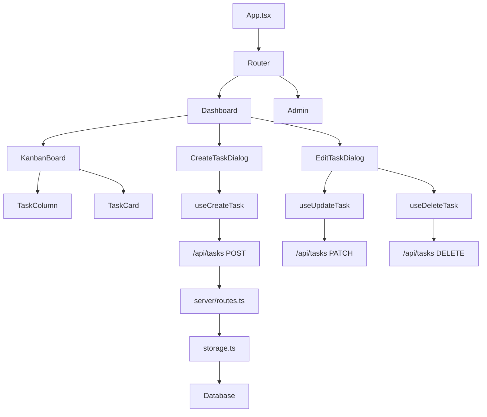

# Component Index

This document provides a comprehensive index of all components, modules, and their relationships in the codebase.

## Frontend Components

### Page Components

#### Dashboard (`client/src/pages/Dashboard.tsx`)

Main application page displaying the Kanban board.

**Props**: None

**Features**:
- Displays Kanban board with tasks organized by stages
- Search functionality for filtering tasks
- Task creation dialog trigger
- Task editing dialog (opens on task click)
- Loading and error states

**Key Dependencies**:
- `useTasks` hook for fetching tasks
- `KanbanBoard` component for board display
- `CreateTaskDialog` for task creation
- `EditTaskDialog` for task editing

**Usage**:
```12:14:client/src/App.tsx
      <Route path="/" component={Dashboard} />
```

#### Admin (`client/src/pages/Admin.tsx`)

Administrative interface for managing stages.

**Props**: None

**Features**:
- List all stages with order information
- Create new stages
- Edit existing stages
- Delete stages
- Form validation using React Hook Form and Zod

**Key Dependencies**:
- React Query for stage data fetching
- Form components from shadcn/ui
- Toast notifications for user feedback

**Usage**:
```14:14:client/src/App.tsx
      <Route path="/admin" component={Admin} />
```

#### NotFound (`client/src/pages/not-found.tsx`)

404 error page component.

**Usage**:
```15:15:client/src/App.tsx
      <Route component={NotFound} />
```

### Core Components

#### KanbanBoard (`client/src/components/KanbanBoard.tsx`)

Main board component implementing drag-and-drop functionality.

**Props**:
```27:30:client/src/components/KanbanBoard.tsx
interface KanbanBoardProps {
  tasks: Task[];
  onTaskClick: (task: Task) => void;
}
```

**Features**:
- Drag-and-drop using @dnd-kit
- Task organization by stages
- Visual feedback during drag operations
- Optimistic UI updates

**Key Dependencies**:
- `@dnd-kit/core` for drag-and-drop
- `@dnd-kit/sortable` for sortable lists
- `TaskColumn` for stage columns
- `TaskCard` for individual tasks
- `useUpdateTask` hook for updating task stages

**Implementation Details**:
- Uses `DndContext` for drag management
- `SortableContext` for each stage column
- `DragOverlay` for drag preview
- Optimistic updates before API call completes

#### TaskCard (`client/src/components/TaskCard.tsx`)

Individual task card component with drag handle.

**Props**:
```8:11:client/src/components/TaskCard.tsx
interface TaskCardProps {
  task: Task;
  onClick: (task: Task) => void;
}
```

**Features**:
- Displays task title and description
- Shows task ID badge
- Displays creation date
- Drag handle (grip icon) on hover
- Click handler for editing

**Key Dependencies**:
- `@dnd-kit/sortable` for drag functionality
- shadcn/ui `Card` component
- `Badge` component for task ID

**Styling**:
- Hover effects and transitions
- Opacity change when dragging
- Responsive design

#### TaskColumn (`client/src/components/TaskColumn.tsx`)

Column component representing a stage in the Kanban board.

**Props**:
```5:10:client/src/components/TaskColumn.tsx
interface TaskColumnProps {
  id: string;
  title: string;
  count: number;
  children: React.ReactNode;
}
```

**Features**:
- Drop zone for tasks
- Visual feedback when dragging over
- Task count badge
- Color-coded headers (backlog, in-progress, done)
- Responsive layout

**Key Dependencies**:
- `@dnd-kit/core` `useDroppable` hook
- shadcn/ui `Badge` component

**Styling**:
- Conditional colors based on stage type
- Ring highlight when dragging over
- Sticky header

#### CreateTaskDialog (`client/src/components/CreateTaskDialog.tsx`)

Dialog component for creating new tasks.

**Props**: None (internal state)

**Features**:
- Form with title, description, and stage selection
- Validation using React Hook Form and Zod
- Stage dropdown populated from API
- Toast notifications on success/error
- Auto-reset form on success

**Key Dependencies**:
- `useCreateTask` hook
- `useToast` hook
- React Hook Form
- shadcn/ui Dialog and Form components
- `useQuery` for fetching stages

**Form Fields**:
- Title (required, text input)
- Stage (required, select dropdown)
- Description (optional, textarea)

#### EditTaskDialog (`client/src/components/EditTaskDialog.tsx`)

Dialog component for editing and deleting tasks.

**Props**:
```41:45:client/src/components/EditTaskDialog.tsx
interface EditTaskDialogProps {
  task: Task | null;
  open: boolean;
  onOpenChange: (open: boolean) => void;
}
```

**Features**:
- Edit task title, description, and stage
- Delete task with confirmation dialog
- Form pre-populated with task data
- Toast notifications
- Optimistic updates

**Key Dependencies**:
- `useUpdateTask` hook
- `useDeleteTask` hook
- `useToast` hook
- React Hook Form
- AlertDialog for delete confirmation

**Form Fields**:
- Title (text input)
- Stage (select dropdown)
- Description (textarea)

### UI Components (shadcn/ui)

Located in `client/src/components/ui/`, these are reusable UI primitives built on Radix UI:

- **accordion.tsx**: Collapsible content sections
- **alert-dialog.tsx**: Modal dialogs for confirmations
- **alert.tsx**: Alert/info messages
- **button.tsx**: Button component variants
- **card.tsx**: Card container component
- **dialog.tsx**: Modal dialog component
- **form.tsx**: Form wrapper with React Hook Form integration
- **input.tsx**: Text input component
- **label.tsx**: Form label component
- **select.tsx**: Dropdown select component
- **textarea.tsx**: Multi-line text input
- **toast.tsx**: Toast notification system
- **badge.tsx**: Badge/label component
- **tooltip.tsx**: Tooltip component

And many more - see `client/src/components/ui/` directory for complete list.

## Backend Modules

### Server Entry Point (`server/index.ts`)

Main Express server setup and configuration.

**Responsibilities**:
- Express app initialization
- Middleware setup (JSON parsing, logging)
- Route registration
- Static file serving (production)
- Vite dev middleware (development)
- HTTP server creation and listening

**Key Functions**:
- `log()`: Custom logging utility with timestamp formatting
- Request/response logging middleware
- Error handling middleware

**Configuration**:
- Port: `process.env.PORT || 5000`
- Host: `0.0.0.0` (all interfaces)
- Environment-based static/Vite setup

### Routes (`server/routes.ts`)

API route handlers and endpoint definitions.

**Main Function**:
```7:10:server/routes.ts
export async function registerRoutes(
  httpServer: Server,
  app: Express
): Promise<Server> {
```

**Responsibilities**:
- Database seeding (initial stages and tasks)
- Task CRUD endpoints
- Stage CRUD endpoints
- Input validation using Zod
- Error handling and status codes

**Endpoints Registered**:
- `GET /api/tasks` - List all tasks
- `POST /api/tasks` - Create task
- `PATCH /api/tasks/:id` - Update task
- `DELETE /api/tasks/:id` - Delete task
- `GET /api/stages` - List all stages
- `POST /api/stages` - Create stage
- `PATCH /api/stages/:id` - Update stage
- `DELETE /api/stages/:id` - Delete stage

**Error Handling**:
- Zod validation errors return 400
- Not found errors return 404
- Server errors return 500

### Storage Layer (`server/storage.ts`)

Data access abstraction layer.

**Interface**:
```5:15:server/storage.ts
export interface IStorage {
  getTasks(): Promise<Task[]>;
  getTasksByStage(stageId: number): Promise<Task[]>;
  createTask(task: InsertTask): Promise<Task>;
  updateTask(id: number, task: Partial<InsertTask>): Promise<Task | undefined>;
  deleteTask(id: number): Promise<void>;
  getStages(): Promise<Stage[]>;
  createStage(stage: InsertStage): Promise<Stage>;
  updateStage(id: number, stage: Partial<InsertStage>): Promise<Stage | undefined>;
  deleteStage(id: number): Promise<void>;
}
```

**Implementation**: `DatabaseStorage` class

**Methods**:
- Task operations: get, getByStage, create, update, delete
- Stage operations: get, create, update, delete

**Database Access**:
- Uses Drizzle ORM for type-safe queries
- Returns typed results matching schema
- Handles database errors

### Database Connection (`server/db.ts`)

PostgreSQL database connection setup.

**Exports**:
- `pool`: PostgreSQL connection pool
- `db`: Drizzle ORM instance with schema

**Configuration**:
- Connection string from `process.env.DATABASE_URL`
- Schema imported from `@shared/schema`
- Error handling for missing DATABASE_URL

### Static File Serving (`server/static.ts`)

Production static file serving.

**Function**:
```5:19:server/static.ts
export function serveStatic(app: Express) {
  const distPath = path.resolve(__dirname, "public");
  if (!fs.existsSync(distPath)) {
    throw new Error(
      `Could not find the build directory: ${distPath}, make sure to build the client first`,
    );
  }

  app.use(express.static(distPath));

  // fall through to index.html if the file doesn't exist
  app.use("*", (_req, res) => {
    res.sendFile(path.resolve(distPath, "index.html"));
  });
}
```

**Responsibilities**:
- Serve static files from `dist/public`
- SPA routing fallback to `index.html`
- Error if build directory missing

### Vite Dev Middleware (`server/vite.ts`)

Development mode Vite integration (not shown in detail, imported dynamically).

**Usage**: Only in development mode, sets up Vite middleware for HMR.

## Shared Code

### Schema (`shared/schema.ts`)

Database schema and validation schemas.

**Exports**:
- `stages` table definition
- `tasks` table definition
- `tasksRelations` and `stagesRelations` for Drizzle relations
- `insertStageSchema` Zod schema
- `insertTaskSchema` Zod schema
- TypeScript types: `Stage`, `Task`, `InsertStage`, `InsertTask`

**Table Definitions**:
```6:19:shared/schema.ts
export const stages = pgTable("stages", {
  id: serial("id").primaryKey(),
  name: text("name").notNull(),
  order: integer("order").notNull(),
  createdAt: timestamp("created_at").defaultNow(),
});

export const tasks = pgTable("tasks", {
  id: serial("id").primaryKey(),
  title: text("title").notNull(),
  description: text("description"),
  stageId: integer("stage_id").notNull().references(() => stages.id),
  createdAt: timestamp("created_at").defaultNow(),
});
```

### Routes (`shared/routes.ts`)

Centralized API route definitions with type-safe schemas.

**Structure**:
```4:75:shared/routes.ts
export const api = {
  tasks: {
    list: {
      method: "GET" as const,
      path: "/api/tasks",
      responses: {
        200: z.array(z.custom<typeof tasks.$inferSelect>()),
      },
    },
    create: {
      method: "POST" as const,
      path: "/api/tasks",
      input: insertTaskSchema,
      responses: {
        201: z.custom<typeof tasks.$inferSelect>(),
        400: z.object({ message: z.string() }),
      },
    },
    update: {
      method: "PATCH" as const,
      path: "/api/tasks/:id",
      input: insertTaskSchema.partial(),
      responses: {
        200: z.custom<typeof tasks.$inferSelect>(),
        404: z.object({ message: z.string() }),
      },
    },
    delete: {
      method: "DELETE" as const,
      path: "/api/tasks/:id",
      responses: {
        204: z.void(),
        404: z.object({ message: z.string() }),
      },
    },
  },
  stages: {
    list: {
      method: "GET" as const,
      path: "/api/stages",
      responses: {
        200: z.array(z.custom<typeof stages.$inferSelect>()),
      },
    },
    create: {
      method: "POST" as const,
      path: "/api/stages",
      input: insertStageSchema,
      responses: {
        201: z.custom<typeof stages.$inferSelect>(),
        400: z.object({ message: z.string() }),
      },
    },
    update: {
      method: "PATCH" as const,
      path: "/api/stages/:id",
      input: insertStageSchema.partial(),
      responses: {
        200: z.custom<typeof stages.$inferSelect>(),
        404: z.object({ message: z.string() }),
      },
    },
    delete: {
      method: "DELETE" as const,
      path: "/api/stages/:id",
      responses: {
        204: z.void(),
        404: z.object({ message: z.string() }),
      },
    },
  },
};
```

**Benefits**:
- Single source of truth for API paths
- Type-safe request/response schemas
- Shared between client and server
- Prevents path mismatches

## Custom Hooks

### useTasks (`client/src/hooks/use-tasks.ts`)

React Query hooks for task operations.

**Exports**:
- `useTasks()`: Query hook for fetching all tasks
- `useCreateTask()`: Mutation hook for creating tasks
- `useUpdateTask()`: Mutation hook for updating tasks
- `useDeleteTask()`: Mutation hook for deleting tasks

**Features**:
- Automatic cache invalidation on mutations
- Type-safe API calls using shared route definitions
- Error handling
- Loading states

**Example Usage**:
```5:14:client/src/hooks/use-tasks.ts
export function useTasks() {
  return useQuery({
    queryKey: [api.tasks.list.path],
    queryFn: async () => {
      const res = await fetch(api.tasks.list.path);
      if (!res.ok) throw new Error("Failed to fetch tasks");
      return api.tasks.list.responses[200].parse(await res.json());
    },
  });
}
```

### useToast (`client/src/hooks/use-toast.ts`)

Toast notification hook (shadcn/ui integration).

**Usage**: Provides toast notifications for user feedback.

### use-mobile (`client/src/hooks/use-mobile.tsx`)

Mobile detection hook (for responsive UI).

## Component Relationships



## Related Documentation

- [Architecture](ARCHITECTURE.md) - System architecture overview
- [API Reference](API_REFERENCE.md) - REST API endpoints
- [Data Flow](DATA_FLOW.md) - Data flow and state management
