# Data Flow Documentation

This document describes how data flows through the application, from user interactions to database updates and back.

## Overview

The application uses React Query for client-side state management, Express.js for the API layer, and Drizzle ORM for database access. Data flows unidirectionally: User → Component → Hook → API → Storage → Database.

## Task Management Flow

### Create Task Flow

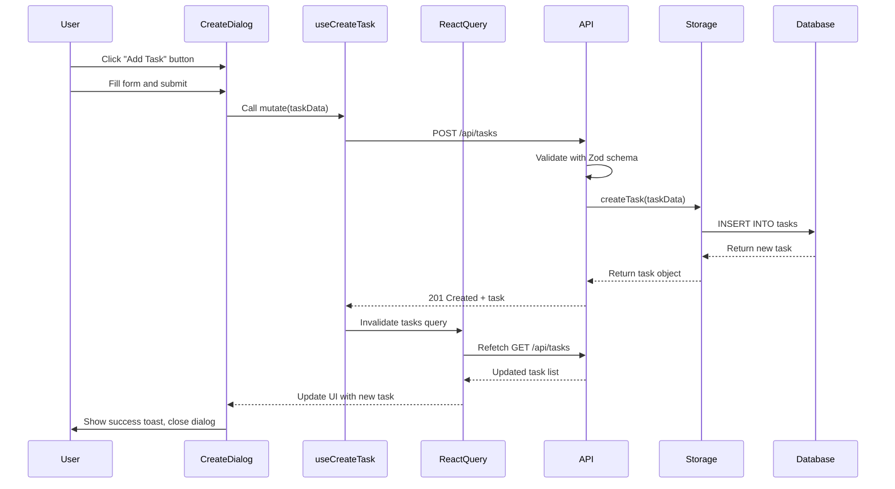

**Implementation Details**:

1. **User Interaction**: User opens dialog and fills form
   ```31:73:client/src/components/CreateTaskDialog.tsx
   export function CreateTaskDialog() {
     const [open, setOpen] = useState(false);
     const { toast } = useToast();
     const createTask = useCreateTask();
   
     const { data: stages = [] } = useQuery({
       queryKey: [api.stages.list.path],
       queryFn: async () => {
         const res = await fetch(api.stages.list.path);
         return res.json();
       },
     });
   
     const defaultStageId = stages[0]?.id || 1;
     
     const form = useForm<InsertTask>({
       resolver: zodResolver(insertTaskSchema),
       defaultValues: {
         title: "",
         description: "",
         stageId: defaultStageId,
       },
     });
   
     const onSubmit = (data: InsertTask) => {
       createTask.mutate(data, {
         onSuccess: () => {
           toast({
             title: "Task created",
             description: "Your new task has been added to the board.",
           });
           setOpen(false);
           form.reset({ stageId: defaultStageId });
         },
         onError: (error) => {
           toast({
             title: "Error",
             description: error.message,
             variant: "destructive",
           });
         },
       });
     };
   ```

2. **Mutation Hook**: Handles API call and cache invalidation
   ```16:35:client/src/hooks/use-tasks.ts
   export function useCreateTask() {
     const queryClient = useQueryClient();
     return useMutation({
       mutationFn: async (task: InsertTask) => {
         const res = await fetch(api.tasks.create.path, {
           method: api.tasks.create.method,
           headers: { "Content-Type": "application/json" },
           body: JSON.stringify(task),
         });
         if (!res.ok) {
           const error = await res.json();
           throw new Error(error.message || "Failed to create task");
         }
         return api.tasks.create.responses[201].parse(await res.json());
       },
       onSuccess: () => {
         queryClient.invalidateQueries({ queryKey: [api.tasks.list.path] });
       },
     });
   }
   ```

3. **API Handler**: Validates and processes request
   ```51:63:server/routes.ts
   app.post(api.tasks.create.path, async (req, res) => {
     try {
       const taskData = api.tasks.create.input.parse(req.body);
       const task = await storage.createTask(taskData);
       res.status(201).json(task);
     } catch (error) {
       if (error instanceof z.ZodError) {
         res.status(400).json({ message: error.errors[0].message });
       } else {
         res.status(500).json({ message: "Internal Server Error" });
       }
     }
   });
   ```

4. **Storage Layer**: Database operation
   ```26:29:server/storage.ts
   async createTask(insertTask: InsertTask): Promise<Task> {
     const [task] = await db.insert(tasks).values(insertTask).returning();
     return task;
   }
   ```

### Update Task Flow

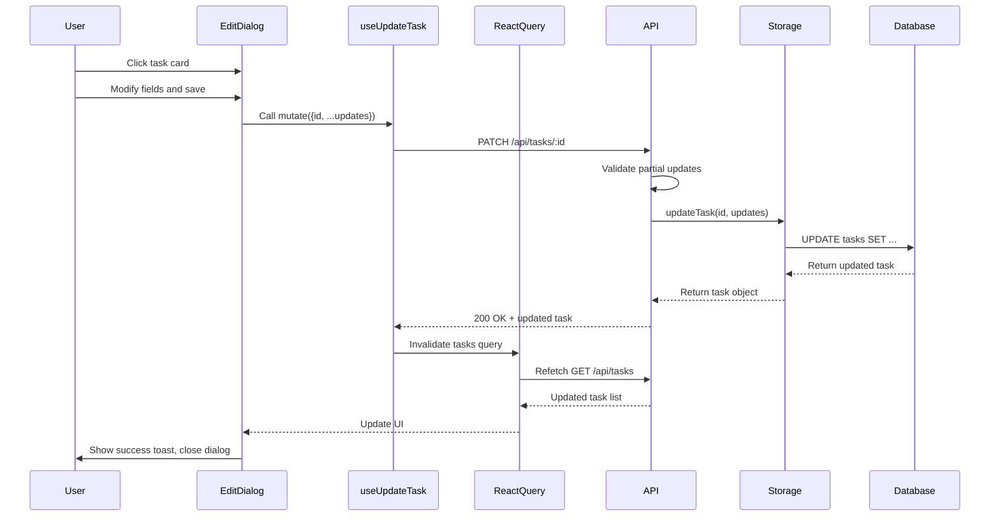

**Implementation**:
```37:61:client/src/hooks/use-tasks.ts
export function useUpdateTask() {
  const queryClient = useQueryClient();
  return useMutation({
    mutationFn: async ({ id, ...updates }: { id: number } & Partial<InsertTask>) => {
      // Manually build URL since buildUrl helper isn't exported in the snippet provided
      // Assuming straightforward substitution for this MVP context
      const url = api.tasks.update.path.replace(":id", id.toString());
      
      const res = await fetch(url, {
        method: api.tasks.update.method,
        headers: { "Content-Type": "application/json" },
        body: JSON.stringify(updates),
      });
      
      if (!res.ok) {
        const error = await res.json();
        throw new Error(error.message || "Failed to update task");
      }
      return api.tasks.update.responses[200].parse(await res.json());
    },
    onSuccess: () => {
      queryClient.invalidateQueries({ queryKey: [api.tasks.list.path] });
    },
  });
}
```

### Delete Task Flow

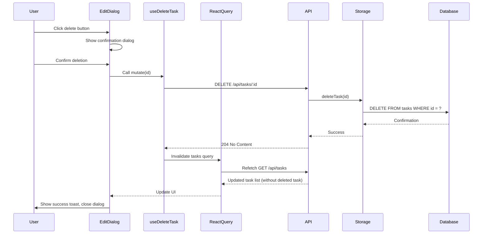

**Implementation**:
```63:81:client/src/hooks/use-tasks.ts
export function useDeleteTask() {
  const queryClient = useQueryClient();
  return useMutation({
    mutationFn: async (id: number) => {
      const url = api.tasks.delete.path.replace(":id", id.toString());
      const res = await fetch(url, {
        method: api.tasks.delete.method,
      });
      
      if (!res.ok) {
        const error = await res.json();
        throw new Error(error.message || "Failed to delete task");
      }
    },
    onSuccess: () => {
      queryClient.invalidateQueries({ queryKey: [api.tasks.list.path] });
    },
  });
}
```

## Drag and Drop Flow

The drag-and-drop functionality allows moving tasks between stages with optimistic updates.

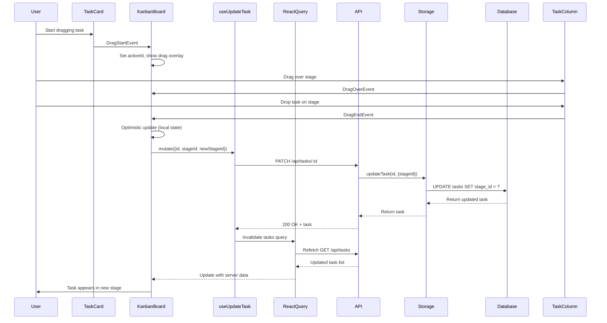

**Implementation Details**:

1. **Drag Start**: Capture active task
   ```58:60:client/src/components/KanbanBoard.tsx
   function handleDragStart(event: DragStartEvent) {
     setActiveId(event.active.id as number);
   }
   ```

2. **Drag End**: Update task stage
   ```62:85:client/src/components/KanbanBoard.tsx
   function handleDragEnd(event: DragEndEvent) {
     const { active, over } = event;
     
     if (!over) {
       setActiveId(null);
       return;
     }
   
     const activeTask = activeTasks.find((t) => t.id === active.id);
     const overContainerId = over.data.current?.sortable?.containerId || over.id;
   
     if (activeTask && typeof overContainerId === 'number') {
       const newStageId = overContainerId as number;
       
       if (activeTask.stageId !== newStageId) {
         setActiveTasks(tasks => 
           tasks.map(t => t.id === activeTask.id ? { ...t, stageId: newStageId } : t)
         );
         updateTask.mutate({ id: activeTask.id, stageId: newStageId });
       }
     }
     
     setActiveId(null);
   }
   ```

3. **Optimistic Update**: Update local state immediately
   ```77:79:client/src/components/KanbanBoard.tsx
   setActiveTasks(tasks => 
     tasks.map(t => t.id === activeTask.id ? { ...t, stageId: newStageId } : t)
   );
   ```

4. **Server Sync**: API call updates database
   ```80:80:client/src/components/KanbanBoard.tsx
   updateTask.mutate({ id: activeTask.id, stageId: newStageId });
   ```

## Admin Page Data Flows

The Admin page manages stages (Kanban board columns) through CRUD operations. Unlike task management which uses custom hooks, the Admin page uses inline mutations with React Query.

### Admin Page Initial Load

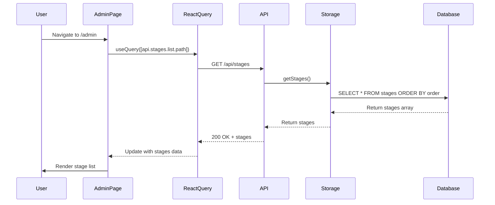

**Implementation**:
```24:30:client/src/pages/Admin.tsx
  const { data: stages = [], isLoading } = useQuery({
    queryKey: [api.stages.list.path],
    queryFn: async () => {
      const res = await fetch(api.stages.list.path);
      return res.json();
    },
  });
```

### Create Stage Flow

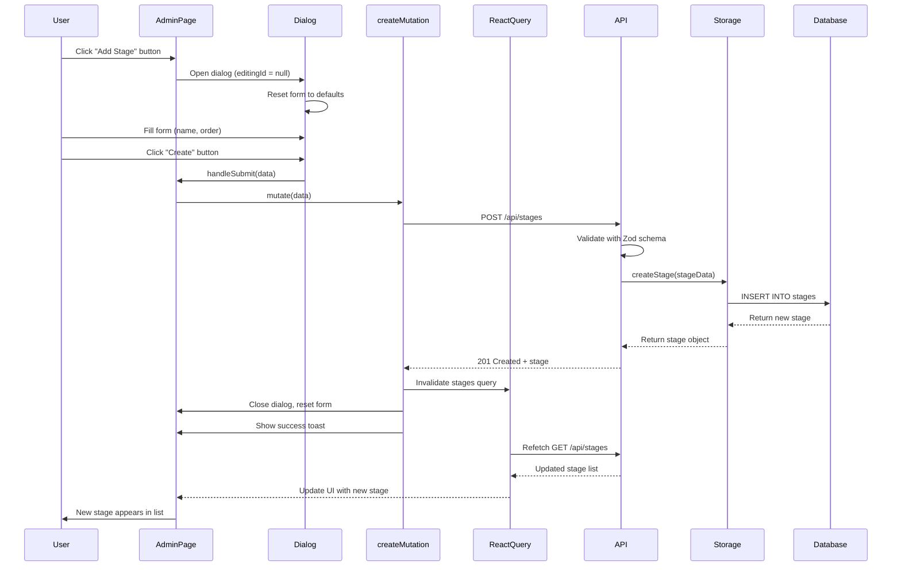

**Implementation Details**:

1. **Form Setup**: React Hook Form with Zod validation
   ```72:75:client/src/pages/Admin.tsx
   const form = useForm<InsertStage>({
     resolver: zodResolver(insertStageSchema),
     defaultValues: { name: "", order: 1 },
   });
   ```

2. **Create Mutation**: Inline mutation with cache invalidation
   ```32:44:client/src/pages/Admin.tsx
   const createMutation = useMutation({
     mutationFn: (data: InsertStage) =>
       apiRequest(api.stages.create.path, {
         method: api.stages.create.method,
         body: JSON.stringify(data),
       }),
     onSuccess: () => {
       queryClient.invalidateQueries({ queryKey: [api.stages.list.path] });
       toast({ description: "Stage created successfully" });
       setDialogOpen(false);
       form.reset();
     },
   });
   ```

3. **Form Submission**: Handles both create and update
   ```77:83:client/src/pages/Admin.tsx
   const handleSubmit = form.handleSubmit((data) => {
     if (editingId) {
       updateMutation.mutate({ id: editingId, data });
     } else {
       createMutation.mutate(data);
     }
   });
   ```

4. **Dialog Reset**: Clear form when opening for create
   ```117:121:client/src/pages/Admin.tsx
   <Button
     onClick={() => {
       setEditingId(null);
       form.reset();
     }}
   ```

### Update Stage Flow

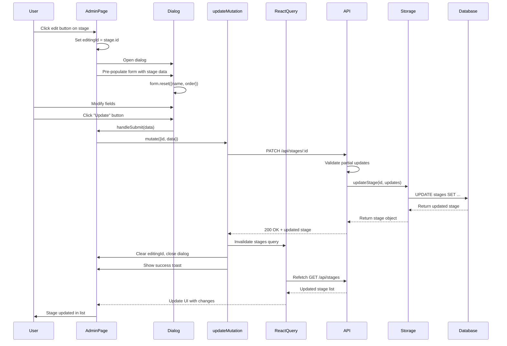

**Implementation Details**:

1. **Edit Dialog Opening**: Pre-populate form with stage data
   ```85:89:client/src/pages/Admin.tsx
   const openEditDialog = (stage: any) => {
     setEditingId(stage.id);
     form.reset({ name: stage.name, order: stage.order });
     setDialogOpen(true);
   };
   ```

2. **Update Mutation**: Similar to create but with ID
   ```46:59:client/src/pages/Admin.tsx
   const updateMutation = useMutation({
     mutationFn: ({ id, data }: { id: number; data: Partial<InsertStage> }) =>
       apiRequest(`${api.stages.update.path.replace(":id", String(id))}`, {
         method: api.stages.update.method,
         body: JSON.stringify(data),
       }),
     onSuccess: () => {
       queryClient.invalidateQueries({ queryKey: [api.stages.list.path] });
       toast({ description: "Stage updated successfully" });
       setEditingId(null);
       setDialogOpen(false);
       form.reset();
     },
   });
   ```

3. **Conditional Dialog Title**: Shows "Edit Stage" vs "Create Stage"
   ```129:129:client/src/pages/Admin.tsx
   <DialogTitle>{editingId ? "Edit Stage" : "Create Stage"}</DialogTitle>
   ```

### Delete Stage Flow

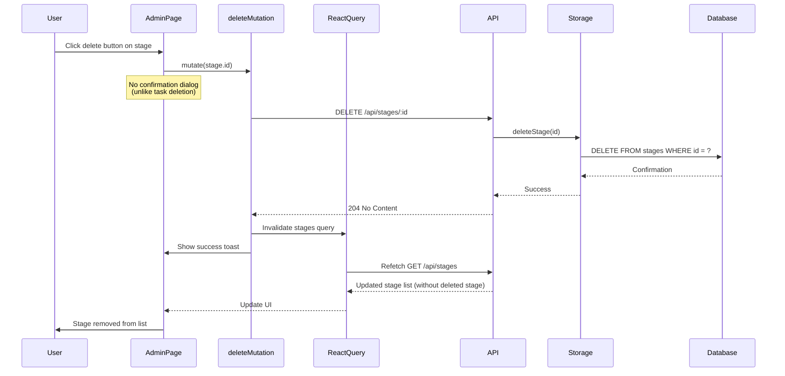

**Implementation Details**:

1. **Delete Mutation**: Direct deletion without confirmation
   ```61:70:client/src/pages/Admin.tsx
   const deleteMutation = useMutation({
     mutationFn: (id: number) =>
       apiRequest(`${api.stages.delete.path.replace(":id", String(id))}`, {
         method: api.stages.delete.method,
       }),
     onSuccess: () => {
       queryClient.invalidateQueries({ queryKey: [api.stages.list.path] });
       toast({ description: "Stage deleted successfully" });
     },
   });
   ```

2. **Delete Button**: Direct mutation call
   ```197:205:client/src/pages/Admin.tsx
   <Button
     variant="destructive"
     size="icon"
     onClick={() => deleteMutation.mutate(stage.id)}
     disabled={deleteMutation.isPending}
     data-testid={`button-delete-stage-${stage.id}`}
   >
     <Trash2 className="w-4 h-4" />
   </Button>
   ```

**Important Note**: Unlike task deletion which uses an AlertDialog confirmation, stage deletion happens immediately. Deleting a stage doesn't cascade delete tasks. Tasks referencing deleted stages may cause display issues on the Kanban board.

### Admin Page State Management

The Admin page uses local state for dialog management:

- `editingId`: Tracks which stage is being edited (null = create mode)
- `dialogOpen`: Controls dialog visibility
- Form state managed by React Hook Form

**State Flow**:
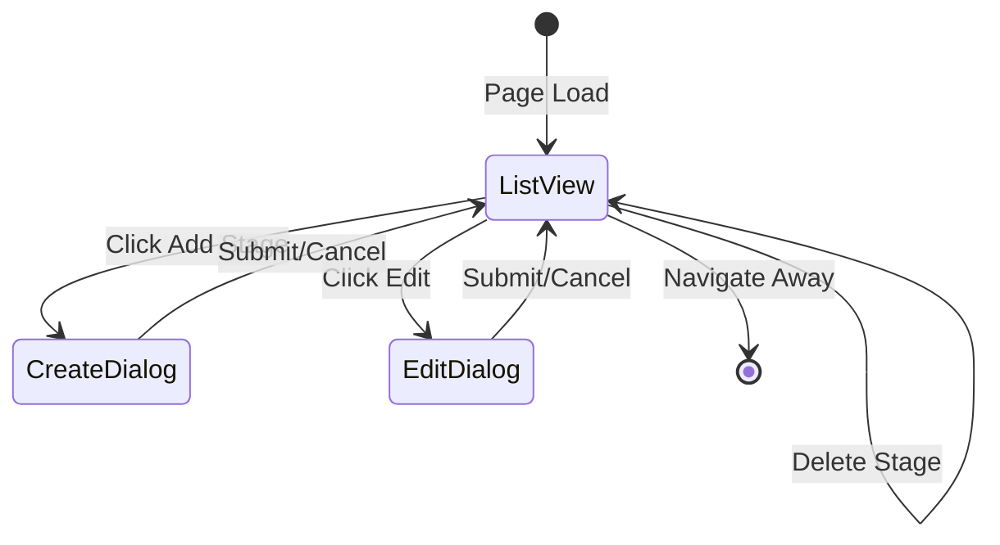

### Differences from Task Management

1. **No Custom Hooks**: Admin uses inline mutations instead of custom hooks like `useTasks`
2. **Shared Dialog**: Single dialog for both create and update (controlled by `editingId`)
3. **No Confirmation**: Stage deletion is immediate (no AlertDialog)
4. **Direct API Calls**: Uses `apiRequest` helper instead of `fetch` directly
5. **Form Reset**: Manual form reset on success (not automatic)

### Cache Invalidation Impact

When stages are modified, the cache invalidation affects:

1. **Admin Page**: Refetches stage list
2. **Dashboard**: KanbanBoard refetches stages to update columns
3. **Task Dialogs**: CreateTaskDialog and EditTaskDialog refetch stages for dropdown

This ensures all components stay in sync when stages change.

## React Query Cache Management

### Query Keys

- Tasks: `[api.tasks.list.path]` → `["/api/tasks"]`
- Stages: `[api.stages.list.path]` → `["/api/stages"]`

### Cache Invalidation Strategy

After mutations, queries are invalidated to ensure fresh data:

```typescript
onSuccess: () => {
  queryClient.invalidateQueries({ queryKey: [api.tasks.list.path] });
}
```

This triggers:
1. Mark query as stale
2. Refetch in background
3. Update UI with new data

### Optimistic Updates

Drag-and-drop uses optimistic updates for immediate UI feedback:

1. Update local state immediately
2. Send API request
3. If successful, cache invalidation syncs with server
4. If failed, React Query can rollback (not currently implemented)

## Data Fetching Patterns

### Initial Load

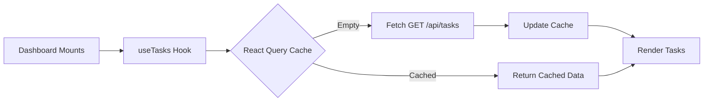

**Implementation**:
```5:14:client/src/hooks/use-tasks.ts
export function useTasks() {
  return useQuery({
    queryKey: [api.tasks.list.path],
    queryFn: async () => {
      const res = await fetch(api.tasks.list.path);
      if (!res.ok) throw new Error("Failed to fetch tasks");
      return api.tasks.list.responses[200].parse(await res.json());
    },
  });
}
```

### Refetch on Window Focus

React Query automatically refetches stale queries when window regains focus (default behavior).

### Manual Refetch

Components can trigger manual refetches:

```typescript
const { data, refetch } = useTasks();
// Later...
refetch();
```

## Error Handling Flow

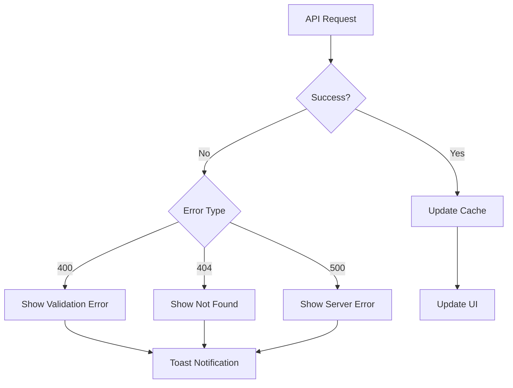

**Error Handling in Hooks**:
```25:28:client/src/hooks/use-tasks.ts
if (!res.ok) {
  const error = await res.json();
  throw new Error(error.message || "Failed to create task");
}
```

**Error Handling in Components**:
```65:72:client/src/components/CreateTaskDialog.tsx
onError: (error) => {
  toast({
    title: "Error",
    description: error.message,
    variant: "destructive",
  });
},
```

## State Synchronization

### Single Source of Truth

- **Server**: PostgreSQL database
- **Client Cache**: React Query cache
- **Local State**: Component state (for UI-only concerns)

### Cache Consistency

- Mutations invalidate related queries
- Stale queries refetch automatically
- No manual cache updates (rely on invalidation)

### Race Condition Prevention

React Query handles:
- Duplicate request deduplication
- Request cancellation on unmount
- Automatic retry on failure

## Related Documentation

- [Architecture](ARCHITECTURE.md) - System architecture overview
- [Component Index](COMPONENT_INDEX.md) - Component documentation
- [API Reference](API_REFERENCE.md) - REST API endpoints
