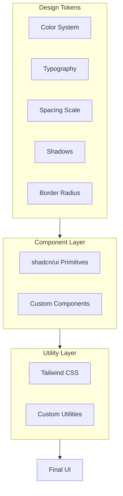

# UI/UX Design & Styling Guide

Comprehensive guide to the design system, styling patterns, and UI/UX implementation details for the Kanban application.

## Design Philosophy

The application follows a modern, clean design system with:
- **Minimalist aesthetic**: Clean interfaces with purposeful use of space
- **Consistent visual language**: Unified color palette, typography, and spacing
- **Accessibility-first**: WCAG-compliant color contrasts and interactive elements
- **Responsive design**: Mobile-first approach with adaptive layouts
- **Smooth interactions**: Subtle animations and transitions for better UX

## Design System Architecture



## Color System

### Color Palette

The application uses a CSS variable-based color system supporting light and dark modes.

#### Light Mode Colors

```8:32:client/src/index.css
  :root {
    --background: 210 20% 98%;
    --foreground: 224 71.4% 4.1%;
    --card: 0 0% 100%;
    --card-foreground: 224 71.4% 4.1%;
    --popover: 0 0% 100%;
    --popover-foreground: 224 71.4% 4.1%;
    --primary: 262 83% 58%;
    --primary-foreground: 210 20% 98%;
    --secondary: 220 14.3% 95.9%;
    --secondary-foreground: 220.9 39.3% 11%;
    --muted: 220 14.3% 95.9%;
    --muted-foreground: 220 8.9% 46.1%;
    --accent: 262 83% 58%;
    --accent-foreground: 210 20% 98%;
    --destructive: 0 84.2% 60.2%;
    --destructive-foreground: 210 20% 98%;
    --border: 220 13% 91%;
    --input: 220 13% 91%;
    --ring: 262 83% 58%;
    --radius: 0.75rem;

    --font-sans: 'Inter', sans-serif;
    --font-display: 'Space Grotesk', sans-serif;
  }
```

#### Dark Mode Colors

```34:54:client/src/index.css
  .dark {
    --background: 224 71.4% 4.1%;
    --foreground: 210 20% 98%;
    --card: 224 71.4% 4.1%;
    --card-foreground: 210 20% 98%;
    --popover: 224 71.4% 4.1%;
    --popover-foreground: 210 20% 98%;
    --primary: 263 70% 50%;
    --primary-foreground: 210 20% 98%;
    --secondary: 215 27.9% 16.9%;
    --secondary-foreground: 210 20% 98%;
    --muted: 215 27.9% 16.9%;
    --muted-foreground: 217.9 10.6% 64.9%;
    --accent: 215 27.9% 16.9%;
    --accent-foreground: 210 20% 98%;
    --destructive: 0 62.8% 30.6%;
    --destructive-foreground: 210 20% 98%;
    --border: 215 27.9% 16.9%;
    --input: 215 27.9% 16.9%;
    --ring: 263 70% 50%;
  }
```

### Color Usage Patterns

#### Primary Color (Purple)
- **Usage**: Primary actions, links, focus states, brand elements
- **Light**: `hsl(262, 83%, 58%)` - Vibrant purple
- **Dark**: `hsl(263, 70%, 50%)` - Slightly muted purple
- **Example**: Create task button, header logo gradient

```60:60:client/src/pages/Dashboard.tsx
            <div className="h-10 w-10 bg-gradient-to-br from-primary to-purple-600 rounded-xl flex items-center justify-center shadow-lg shadow-primary/20">
```

#### Secondary Color (Gray)
- **Usage**: Secondary actions, backgrounds, subtle elements
- **Light**: `hsl(220, 14.3%, 95.9%)` - Light gray
- **Dark**: `hsl(215, 27.9%, 16.9%)` - Dark gray

#### Destructive Color (Red)
- **Usage**: Delete actions, error states
- **Light**: `hsl(0, 84.2%, 60.2%)` - Bright red
- **Dark**: `hsl(0, 62.8%, 30.6%)` - Darker red

#### Semantic Colors for Stages

Task columns use semantic colors:

```17:24:client/src/components/TaskColumn.tsx
  const getColumnColor = (id: string) => {
    switch (id) {
      case "backlog": return "bg-gray-100 dark:bg-gray-800/50 border-gray-200 dark:border-gray-800";
      case "in-progress": return "bg-blue-50 dark:bg-blue-900/10 border-blue-100 dark:bg-blue-900/30";
      case "done": return "bg-green-50 dark:bg-green-900/10 border-green-100 dark:border-green-900/30";
      default: return "bg-secondary/30";
    }
  };
```

### Color Implementation

Colors are accessed via Tailwind CSS variables:

```13:54:tailwind.config.ts
      colors: {
        // Flat / base colors (regular buttons)
        background: "hsl(var(--background) / <alpha-value>)",
        foreground: "hsl(var(--foreground) / <alpha-value>)",
        border: "hsl(var(--border) / <alpha-value>)",
        input: "hsl(var(--input) / <alpha-value>)",
        card: {
          DEFAULT: "hsl(var(--card) / <alpha-value>)",
          foreground: "hsl(var(--card-foreground) / <alpha-value>)",
          border: "hsl(var(--card-border) / <alpha-value>)",
        },
        popover: {
          DEFAULT: "hsl(var(--popover) / <alpha-value>)",
          foreground: "hsl(var(--popover-foreground) / <alpha-value>)",
          border: "hsl(var(--popover-border) / <alpha-value>)",
        },
        primary: {
          DEFAULT: "hsl(var(--primary) / <alpha-value>)",
          foreground: "hsl(var(--primary-foreground) / <alpha-value>)",
          border: "var(--primary-border)",
        },
        secondary: {
          DEFAULT: "hsl(var(--secondary) / <alpha-value>)",
          foreground: "hsl(var(--secondary-foreground) / <alpha-value>)",
          border: "var(--secondary-border)",
        },
        muted: {
          DEFAULT: "hsl(var(--muted) / <alpha-value>)",
          foreground: "hsl(var(--muted-foreground) / <alpha-value>)",
          border: "var(--muted-border)",
        },
        accent: {
          DEFAULT: "hsl(var(--accent) / <alpha-value>)",
          foreground: "hsl(var(--accent-foreground) / <alpha-value>)",
          border: "var(--accent-border)",
        },
        destructive: {
          DEFAULT: "hsl(var(--destructive) / <alpha-value>)",
          foreground: "hsl(var(--destructive-foreground) / <alpha-value>)",
          border: "var(--destructive-border)",
        },
        ring: "hsl(var(--ring) / <alpha-value>)",
```

**Usage Example**:
```typescript
// With opacity
className="bg-primary/20"  // 20% opacity
className="text-foreground/80"  // 80% opacity

// Solid colors
className="bg-primary text-primary-foreground"
className="border-border"
```

## Typography

### Font Families

Two font families are used:

1. **Inter** (`--font-sans`): Primary body text
   - Weights: 400, 500, 600, 700
   - Usage: Body text, buttons, forms, UI elements

2. **Space Grotesk** (`--font-display`): Headings and display text
   - Weights: 500, 600, 700
   - Usage: Headings, titles, brand elements

```1:1:client/src/index.css
@import url('https://fonts.googleapis.com/css2?family=Inter:wght@400;500;600;700&family=Space+Grotesk:wght@500;600;700&display=swap');
```

### Typography Scale

```65:68:client/src/index.css
  h1, h2, h3, h4, h5, h6 {
    font-family: var(--font-display);
    @apply font-bold tracking-tight;
  }
```

#### Heading Styles

- **H1**: Large page titles (e.g., "TaskFlow" in header)
- **H2**: Section titles, card titles
- **H3**: Subsection titles

**Example Implementation**:
```43:43:client/src/components/TaskColumn.tsx
          <h2 className={cn("font-display font-bold text-sm uppercase tracking-wider", getHeaderColor(id))}>
```

#### Body Text

- **Base**: `text-sm` (14px) - Standard body text
- **Small**: `text-xs` (12px) - Secondary information, badges
- **Tiny**: `text-[10px]` - Timestamps, metadata

**Example**:
```69:71:client/src/components/TaskCard.tsx
            <span className="text-[10px] text-muted-foreground">
              {new Date(task.createdAt || new Date()).toLocaleDateString()}
            </span>
```

### Font Weight Usage

- **400 (Regular)**: Body text
- **500 (Medium)**: Buttons, labels
- **600 (Semibold)**: Card titles, important text
- **700 (Bold)**: Headings, emphasis

**Example**:
```51:52:client/src/components/TaskCard.tsx
          <CardTitle className="text-base font-semibold leading-tight pr-6">
            {task.title}
```

## Spacing & Layout

### Spacing Scale

Uses Tailwind's default spacing scale (4px base unit):
- `p-2` = 8px
- `p-4` = 16px
- `p-6` = 24px
- `gap-2` = 8px
- `gap-4` = 16px
- `gap-6` = 24px

### Layout Patterns

#### Container Layout

```55:55:client/src/pages/Dashboard.tsx
    <div className="min-h-screen bg-background flex flex-col">
```

- `min-h-screen`: Full viewport height
- `flex flex-col`: Vertical flex layout
- Container max-width: `max-w-6xl mx-auto` (Admin page)

#### Grid/Flex Patterns

**Kanban Board Layout**:
```96:96:client/src/components/KanbanBoard.tsx
      <div className="flex flex-col lg:flex-row h-full gap-6 overflow-y-auto lg:overflow-y-visible lg:overflow-x-auto pb-4">
```

- Mobile: Vertical stack (`flex-col`)
- Desktop: Horizontal row (`lg:flex-row`)
- Gap: `gap-6` (24px) between columns

**Task Column**:
```36:36:client/src/components/TaskColumn.tsx
    <div className="flex-1 w-full lg:min-w-[300px] flex flex-col h-auto lg:h-full rounded-2xl bg-card/50 backdrop-blur-sm">
```

- `flex-1`: Equal width distribution
- `lg:min-w-[300px]`: Minimum width on desktop
- `h-auto lg:h-full`: Full height on desktop

## Border Radius

### Radius Scale

```8:12:tailwind.config.ts
      borderRadius: {
        lg: ".5625rem", /* 9px */
        md: ".375rem", /* 6px */
        sm: ".1875rem", /* 3px */
      },
```

### Usage Patterns

- **Small** (`rounded-md`): Buttons, inputs, badges
- **Medium** (`rounded-lg`): Cards, dialogs
- **Large** (`rounded-xl`): Header logo, search inputs
- **Extra Large** (`rounded-2xl`): Task columns, large cards
- **Extra Extra Large** (`rounded-3xl`): Empty states, hero sections

**Examples**:
```60:60:client/src/pages/Dashboard.tsx
            <div className="h-10 w-10 bg-gradient-to-br from-primary to-purple-600 rounded-xl flex items-center justify-center shadow-lg shadow-primary/20">
```

```109:109:client/src/pages/Dashboard.tsx
            <div className="h-full flex flex-col items-center justify-center text-center p-8 border-2 border-dashed border-border rounded-3xl bg-secondary/10 m-4">
```

## Shadows & Depth

### Shadow System

- **sm**: `shadow-sm` - Subtle elevation
- **md**: `shadow-md` - Medium elevation (hover states)
- **lg**: `shadow-lg` - High elevation (modals, floating elements)
- **xl**: `shadow-xl` - Maximum elevation

### Shadow Usage

**Card Hover**:
```48:48:client/src/components/TaskCard.tsx
        className="group relative cursor-pointer bg-card hover:border-primary/50 transition-all duration-200 shadow-sm hover:shadow-md active:scale-[0.98]"
```

**Header Logo**:
```60:60:client/src/pages/Dashboard.tsx
            <div className="h-10 w-10 bg-gradient-to-br from-primary to-purple-600 rounded-xl flex items-center justify-center shadow-lg shadow-primary/20">
```

**Custom Shadow Utilities**:
```76:78:client/src/index.css
  .card-hover {
    @apply transition-all duration-300 hover:shadow-lg hover:-translate-y-1 hover:border-primary/50;
  }
```

## Component Styling Patterns

### Button Variants

Buttons use `class-variance-authority` (CVA) for variant management:

```7:39:client/src/components/ui/button.tsx
const buttonVariants = cva(
  "inline-flex items-center justify-center gap-2 whitespace-nowrap rounded-md text-sm font-medium focus-visible:outline-none focus-visible:ring-1 focus-visible:ring-ring disabled:pointer-events-none disabled:opacity-50 [&_svg]:pointer-events-none [&_svg]:size-4 [&_svg]:shrink-0" +
  " hover-elevate active-elevate-2",
  {
    variants: {
      variant: {
        default:
          "bg-primary text-primary-foreground border border-primary-border",
        destructive:
          "bg-destructive text-destructive-foreground border border-destructive-border",
        outline:
          // Shows the background color of whatever card / sidebar / accent background it is inside of.
          // Inherits the current text color.
          " border [border-color:var(--button-outline)]  shadow-xs active:shadow-none ",
        secondary: "border bg-secondary text-secondary-foreground border border-secondary-border ",
        // Add a transparent border so that when someone toggles a border on later, it doesn't shift layout/size.
        ghost: "border border-transparent",
      },
      // Heights are set as "min" heights, because sometimes Ai will place large amount of content
      // inside buttons. With min-height they will look appropriate with small amounts of content,
      // but will expand to fit large amounts of content.
      size: {
        default: "min-h-9 px-4 py-2",
        sm: "min-h-8 rounded-md px-3 text-xs",
        lg: "min-h-10 rounded-md px-8",
        icon: "h-9 w-9",
      },
    },
    defaultVariants: {
      variant: "default",
      size: "default",
    },
  },
)
```

**Button Sizes**:
- `default`: `min-h-9` (36px) with `px-4 py-2`
- `sm`: `min-h-8` (32px) with `px-3`
- `lg`: `min-h-10` (40px) with `px-8`
- `icon`: `h-9 w-9` (36x36px square)

### Card Component

```11:14:client/src/components/ui/card.tsx
    className={cn(
      "shadcn-card rounded-xl border bg-card border-card-border text-card-foreground shadow-sm",
      className
    )}
```

**Card Structure**:
- `Card`: Container with rounded corners and shadow
- `CardHeader`: Top section with `p-6` padding
- `CardTitle`: Bold heading text
- `CardContent`: Main content area with `p-6 pt-0` padding

**Task Card Implementation**:
```46:74:client/src/components/TaskCard.tsx
    <div ref={setNodeRef} style={style} {...attributes} {...listeners}>
      <Card
        onClick={() => onClick(task)}
        className="group relative cursor-pointer bg-card hover:border-primary/50 transition-all duration-200 shadow-sm hover:shadow-md active:scale-[0.98]"
      >
        <CardHeader className="p-4 pb-2 flex flex-row items-start justify-between space-y-0">
          <CardTitle className="text-base font-semibold leading-tight pr-6">
            {task.title}
          </CardTitle>
          <GripVertical className="h-4 w-4 text-muted-foreground opacity-0 group-hover:opacity-100 absolute top-4 right-3 transition-opacity" />
        </CardHeader>
        <CardContent className="p-4 pt-2">
          {task.description && (
            <p className="text-sm text-muted-foreground line-clamp-2 mb-3">
              {task.description}
            </p>
          )}
          <div className="flex items-center justify-between mt-auto">
            <Badge 
              variant="secondary" 
              className="text-xs font-normal bg-secondary/50 text-secondary-foreground/80"
            >
              #{task.id}
            </Badge>
            <span className="text-[10px] text-muted-foreground">
              {new Date(task.createdAt || new Date()).toLocaleDateString()}
            </span>
          </div>
        </CardContent>
      </Card>
```

### Input Components

**Search Input**:
```74:74:client/src/pages/Dashboard.tsx
                className="pl-9 h-10 rounded-xl bg-secondary/50 border-transparent focus:bg-background focus:border-primary transition-all"
```

**Form Inputs**: Use shadcn/ui Input component with consistent styling:
- Height: `h-10` (40px)
- Border radius: `rounded-xl`
- Focus states: Border color change and background transition

### Badge Component

Used for task IDs and counts:

```47:49:client/src/components/TaskColumn.tsx
        <Badge variant="outline" className="font-mono text-xs">
          {count}
```

```63:68:client/src/components/TaskCard.tsx
            <Badge 
              variant="secondary" 
              className="text-xs font-normal bg-secondary/50 text-secondary-foreground/80"
            >
              #{task.id}
```

## Responsive Design

### Breakpoint Strategy

Uses Tailwind's default breakpoints:
- `sm`: 640px
- `md`: 768px
- `lg`: 1024px
- `xl`: 1280px
- `2xl`: 1536px

### Mobile-First Approach

**Header Layout**:
```57:88:client/src/pages/Dashboard.tsx
      <header className="border-b border-border/40 bg-background/80 backdrop-blur-md sticky top-0 z-50">
        <div className="container mx-auto px-4 h-16 flex items-center justify-between">
          <div className="flex items-center gap-3">
            <div className="h-10 w-10 bg-gradient-to-br from-primary to-purple-600 rounded-xl flex items-center justify-center shadow-lg shadow-primary/20">
              <LayoutDashboard className="text-white h-5 w-5" />
            </div>
            <div>
              <h1 className="text-xl font-bold tracking-tight">TaskFlow</h1>
              <p className="text-xs text-muted-foreground hidden sm:block">Project Management</p>
            </div>
          </div>
          
          <div className="flex items-center gap-4">
            <div className="relative hidden md:block w-64">
              <Search className="absolute left-3 top-1/2 -translate-y-1/2 h-4 w-4 text-muted-foreground" />
              <Input 
                placeholder="Search tasks..." 
                className="pl-9 h-10 rounded-xl bg-secondary/50 border-transparent focus:bg-background focus:border-primary transition-all"
                value={searchQuery}
                onChange={(e) => setSearchQuery(e.target.value)}
                data-testid="input-search"
              />
            </div>
            <CreateTaskDialog />
            <a href="/admin">
              <button className="px-4 py-2 text-sm font-medium rounded-lg border border-border hover-elevate" data-testid="button-admin">
                Admin
              </button>
            </a>
          </div>
        </div>
      </header>
```

**Responsive Features**:
- Search bar: Hidden on mobile (`hidden md:block`)
- Subtitle: Hidden on small screens (`hidden sm:block`)
- Mobile search: Separate section below header (`md:hidden`)

**Kanban Board Responsive**:
```96:96:client/src/components/KanbanBoard.tsx
      <div className="flex flex-col lg:flex-row h-full gap-6 overflow-y-auto lg:overflow-y-visible lg:overflow-x-auto pb-4">
```

- Mobile: Vertical stack (`flex-col`)
- Desktop: Horizontal row (`lg:flex-row`)
- Overflow: Vertical on mobile, horizontal on desktop

## Animations & Transitions

### Transition Patterns

**Standard Transitions**:
- `transition-all`: All properties animate
- `duration-200`: 200ms duration (fast)
- `duration-300`: 300ms duration (standard)

**Card Hover**:
```48:48:client/src/components/TaskCard.tsx
        className="group relative cursor-pointer bg-card hover:border-primary/50 transition-all duration-200 shadow-sm hover:shadow-md active:scale-[0.98]"
```

**Button Interactions**:
- Hover: Elevation effect (`hover-elevate`)
- Active: Scale down (`active:scale-[0.98]`)
- Focus: Ring outline (`focus-visible:ring-1`)

### Custom Animation Utilities

**Hover Elevate** (defined in CSS):
```76:78:client/src/index.css
  .card-hover {
    @apply transition-all duration-300 hover:shadow-lg hover:-translate-y-1 hover:border-primary/50;
  }
```

**Usage**:
```82:82:client/src/pages/Dashboard.tsx
              <button className="px-4 py-2 text-sm font-medium rounded-lg border border-border hover-elevate" data-testid="button-admin">
```

### Drag & Drop Animations

**Dragging State**:
```34:41:client/src/components/TaskCard.tsx
  if (isDragging) {
    return (
      <div
        ref={setNodeRef}
        style={style}
        className="opacity-30 bg-primary/10 border-2 border-primary border-dashed rounded-xl h-[120px]"
      />
    );
  }
```

**Drag Overlay**:
```125:134:client/src/components/KanbanBoard.tsx
      <DragOverlay>
        {activeId ? (
          <div className="opacity-80 rotate-2 cursor-grabbing">
             <TaskCard 
               task={activeTasks.find(t => t.id === activeId)!} 
               onClick={() => {}} 
             />
          </div>
        ) : null}
      </DragOverlay>
```

### Loading States

**Spinner Animation**:
```29:32:client/src/pages/Dashboard.tsx
        <div className="flex flex-col items-center gap-4 animate-pulse">
          <Loader2 className="h-10 w-10 text-primary animate-spin" />
          <p className="text-muted-foreground font-medium">Loading your board...</p>
        </div>
```

## Accessibility

### Focus States

All interactive elements have visible focus indicators:

```8:8:client/src/components/ui/button.tsx
  "inline-flex items-center justify-center gap-2 whitespace-nowrap rounded-md text-sm font-medium focus-visible:outline-none focus-visible:ring-1 focus-visible:ring-ring disabled:pointer-events-none disabled:opacity-50 [&_svg]:pointer-events-none [&_svg]:size-4 [&_svg]:shrink-0" +
```

- `focus-visible:ring-1`: 1px ring on focus
- `focus-visible:ring-ring`: Uses ring color token
- `outline-none`: Removes default outline (replaced with ring)

### Color Contrast

- All text meets WCAG AA contrast ratios
- Foreground/background pairs defined in CSS variables
- Dark mode maintains contrast ratios

### Keyboard Navigation

- All interactive elements are keyboard accessible
- Focus order follows logical flow
- Drag-and-drop supports keyboard navigation via @dnd-kit

### Screen Reader Support

- Semantic HTML elements used throughout
- ARIA labels where needed
- `data-testid` attributes for testing (also useful for screen readers)

## UI Component Library (shadcn/ui)

### Configuration

```1:20:components.json
{
    "$schema": "https://ui.shadcn.com/schema.json",
    "style": "new-york",
    "rsc": false,
    "tsx": true,
    "tailwind": {
      "config": "tailwind.config.ts",
      "css": "client/src/index.css",
      "baseColor": "neutral",
      "cssVariables": true,
      "prefix": ""
    },
    "aliases": {
      "components": "@/components",
      "utils": "@/lib/utils",
      "ui": "@/components/ui",
      "lib": "@/lib",
      "hooks": "@/hooks"
    }
}
```

### Style Variant

Uses **"new-york"** style variant:
- More rounded corners
- Softer shadows
- Refined spacing

### Key Components Used

1. **Button**: Primary, secondary, destructive, outline, ghost variants
2. **Card**: Container for task cards and content sections
3. **Dialog**: Modal dialogs for create/edit forms
4. **Input**: Text inputs and search fields
5. **Textarea**: Multi-line text input
6. **Select**: Dropdown selects for stage selection
7. **Badge**: Task IDs and counts
8. **Toast**: Notification system
9. **Form**: React Hook Form integration
10. **AlertDialog**: Confirmation dialogs

## Custom Utilities

### Class Name Utility

```1:6:client/src/lib/utils.ts
import { clsx, type ClassValue } from "clsx"
import { twMerge } from "tailwind-merge"

export function cn(...inputs: ClassValue[]) {
  return twMerge(clsx(inputs))
}
```

**Usage**: Merges class names intelligently, handling conflicts:
```typescript
cn("text-red-500", "text-blue-500")  // Returns "text-blue-500"
cn("px-4", "px-6")  // Returns "px-6"
```

### Custom CSS Classes

**Glass Panel**:
```72:74:client/src/index.css
  .glass-panel {
    @apply bg-white/70 backdrop-blur-lg border border-white/20 shadow-xl;
  }
```

**Card Hover**:
```76:78:client/src/index.css
  .card-hover {
    @apply transition-all duration-300 hover:shadow-lg hover:-translate-y-1 hover:border-primary/50;
  }
```

**Custom Scrollbar**:
```82:91:client/src/index.css
::-webkit-scrollbar {
  width: 8px;
  height: 8px;
}
::-webkit-scrollbar-track {
  background: transparent;
}
::-webkit-scrollbar-thumb {
  @apply bg-muted-foreground/20 rounded-full hover:bg-muted-foreground/40 transition-colors;
}
```

## Backdrop Blur Effects

Used for modern glassmorphism effects:

**Header**:
```57:57:client/src/pages/Dashboard.tsx
      <header className="border-b border-border/40 bg-background/80 backdrop-blur-md sticky top-0 z-50">
```

**Task Column**:
```36:36:client/src/components/TaskColumn.tsx
    <div className="flex-1 w-full lg:min-w-[300px] flex flex-col h-auto lg:h-full rounded-2xl bg-card/50 backdrop-blur-sm">
```

**Column Header**:
```37:37:client/src/components/TaskColumn.tsx
      <div className="p-4 flex items-center justify-between sticky top-0 bg-background/95 backdrop-blur z-10 rounded-t-2xl border-b border-border/50">
```

## Implementation Examples

### Gradient Backgrounds

**Header Logo**:
```60:60:client/src/pages/Dashboard.tsx
            <div className="h-10 w-10 bg-gradient-to-br from-primary to-purple-600 rounded-xl flex items-center justify-center shadow-lg shadow-primary/20">
```

- `bg-gradient-to-br`: Gradient from top-left to bottom-right
- `from-primary to-purple-600`: Color stops
- `shadow-primary/20`: Colored shadow with 20% opacity

### Conditional Styling

**Task Column Colors**:
```17:33:client/src/components/TaskColumn.tsx
  const getColumnColor = (id: string) => {
    switch (id) {
      case "backlog": return "bg-gray-100 dark:bg-gray-800/50 border-gray-200 dark:border-gray-800";
      case "in-progress": return "bg-blue-50 dark:bg-blue-900/10 border-blue-100 dark:bg-blue-900/30";
      case "done": return "bg-green-50 dark:bg-green-900/10 border-green-100 dark:border-green-900/30";
      default: return "bg-secondary/30";
    }
  };

  const getHeaderColor = (id: string) => {
    switch (id) {
      case "backlog": return "text-gray-700 dark:text-gray-300";
      case "in-progress": return "text-blue-700 dark:text-blue-400";
      case "done": return "text-green-700 dark:text-green-400";
      default: return "";
    }
  };
```

**Usage with cn()**:
```54:58:client/src/components/TaskColumn.tsx
        className={cn(
          "flex-1 p-4 transition-colors duration-200 rounded-b-2xl border-x border-b border-border/0",
          getColumnColor(id),
          isOver && "ring-2 ring-primary/20 bg-primary/5"
        )}
```

### Group Hover Patterns

**Task Card Grip Icon**:
```54:54:client/src/components/TaskCard.tsx
          <GripVertical className="h-4 w-4 text-muted-foreground opacity-0 group-hover:opacity-100 absolute top-4 right-3 transition-opacity" />
```

- `group`: Parent element with `group` class
- `group-hover:opacity-100`: Shows on parent hover
- `opacity-0`: Hidden by default

### Line Clamping

**Task Description**:
```58:59:client/src/components/TaskCard.tsx
            <p className="text-sm text-muted-foreground line-clamp-2 mb-3">
              {task.description}
```

- `line-clamp-2`: Limits to 2 lines with ellipsis
- Requires `@tailwindcss/typography` plugin

## Best Practices

### 1. Use Design Tokens

Always use CSS variables/Tailwind tokens instead of hardcoded values:
```typescript
// ✅ Good
className="bg-primary text-primary-foreground"

// ❌ Bad
className="bg-purple-600 text-white"
```

### 2. Consistent Spacing

Use the spacing scale consistently:
```typescript
// ✅ Good
className="p-4 gap-4"

// ❌ Bad
className="p-[17px] gap-[13px]"
```

### 3. Responsive Classes

Always consider mobile-first:
```typescript
// ✅ Good
className="flex-col lg:flex-row"

// ❌ Bad
className="flex-row"  // Breaks on mobile
```

### 4. Semantic Color Usage

Use semantic color names:
```typescript
// ✅ Good
className="bg-destructive text-destructive-foreground"

// ❌ Bad
className="bg-red-500 text-white"
```

### 5. Transition All Interactive Elements

Add transitions to interactive elements:
```typescript
// ✅ Good
className="transition-all duration-200 hover:shadow-md"

// ❌ Bad
className="hover:shadow-md"  // No transition
```

## Related Documentation

- [Architecture](ARCHITECTURE.md) - System architecture overview
- [Component Index](COMPONENT_INDEX.md) - Component documentation
- [Data Flow](DATA_FLOW.md) - Data flow and state management
